# Wafer Defect Analysis System - Architecture & Design Specification

**Document Version:** 1.0

**Author:** Manus AI

**Date:** January 17, 2026

**Status:** In Progress

---

## 1. Introduction

This document outlines the system architecture and detailed design for the AI-driven Wafer Defect Analysis System. It translates the comprehensive requirements specification into a concrete technical blueprint for development and deployment. The architecture is designed to be scalable, resilient, and maintainable, leveraging a microservices-based approach orchestrated by Kubernetes.

## 2. High-Level Architecture

The system follows a distributed, microservices architecture. Each core functionality is encapsulated within a dedicated service, communicating via REST APIs and a message queue. This design promotes modularity, independent scalability, and fault isolation.

### 2.1 Architecture Diagram (C4 Model - Level 2)

```mermaid
--- 
title: Wafer Defect Analysis System - Component Diagram
--- 
C4Component

  Person(engineer, "Process/Yield Engineer", "Analyzes wafer defects and provides feedback.")
  Person(data_scientist, "Data Scientist", "Manages and retrains AI models.")
  System_Ext(mes, "Manufacturing Execution System (MES)", "Source of wafer data and consumer of analysis results.")

  System_Boundary(wafer_analysis_system, "Wafer Defect Analysis System") {

    Component(api_gateway, "API Gateway", "Nginx/Kong", "Exposes REST APIs, handles auth, rate limiting, and routing.")

    Component(frontend, "Web UI", "React/Vite", "Provides dashboards for visualization, expert review, and system monitoring.")

    Component(ingestion_service, "Data Ingestion Service", "Python/FastAPI", "Handles wafer map file uploads and parsing (SECS/GEM, CSV, etc.).")

    Component(preprocessing_service, "Preprocessing Service", "Python/OpenCV/CUDA", "Normalizes coordinates, generates wafer map images, and performs data quality checks.")

    Component(inference_service, "Inference Service", "Python/Triton/TensorRT", "Performs defect detection (YOLOv10) and classification (DeiT) on GPUs.")

    Component(gan_service, "GAN Service", "Python/PyTorch/StyleGAN2", "Generates synthetic wafer defect maps for training data augmentation.")

    Component(retraining_service, "Continuous Retraining Service", "Python/Kubeflow/MLflow", "Automates model retraining, A/B testing, and deployment workflows.")

    ComponentDb(database, "PostgreSQL Database", "Stores metadata, results, user feedback, and model versions.")

    ComponentDb(storage, "Object Storage", "S3/MinIO", "Stores raw wafer maps, generated images, and model artifacts.")

    ComponentQueue(message_queue, "Message Queue", "RabbitMQ/Kafka", "Decouples services and manages asynchronous job processing.")
  }

  Rel(engineer, frontend, "Uses", "HTTPS")
  Rel(data_scientist, frontend, "Uses", "HTTPS")
  Rel(frontend, api_gateway, "Makes API calls to", "HTTPS/JSON")

  Rel(mes, api_gateway, "Submits wafers, retrieves results", "HTTPS/JSON")
  Rel(api_gateway, mes, "Publishes alerts and results", "Webhook")

  Rel(api_gateway, ingestion_service, "Routes /ingest requests")
  Rel(api_gateway, preprocessing_service, "Routes /preprocess requests")
  Rel(api_gateway, inference_service, "Routes /inference requests")
  Rel(api_gateway, retraining_service, "Routes /retrain requests")

  Rel(ingestion_service, message_queue, "Publishes 'WaferReceived' event")
  Rel(ingestion_service, storage, "Saves raw wafer map file")

  Rel_Back(preprocessing_service, message_queue, "Consumes 'WaferReceived' event")
  Rel(preprocessing_service, storage, "Saves processed image")
  Rel(preprocessing_service, database, "Saves wafer metadata")
  Rel(preprocessing_service, message_queue, "Publishes 'ImageReadyForInference' event")

  Rel_Back(inference_service, message_queue, "Consumes 'ImageReadyForInference' event")
  Rel(inference_service, storage, "Reads processed image")
  Rel(inference_service, database, "Saves inference results")
  Rel(inference_service, message_queue, "Publishes 'InferenceComplete' event")

  Rel_Back(frontend, database, "Reads results for display")

  Rel(data_scientist, gan_service, "Triggers synthetic data generation")
  Rel(gan_service, storage, "Saves synthetic images")
  Rel(gan_service, database, "Logs generation metadata")

  Rel(retraining_service, database, "Reads training data and feedback")
  Rel(retraining_service, storage, "Reads images, saves new models")
  Rel(retraining_service, inference_service, "Deploys updated models to")

```

### 2.2 Technology Stack

| Component | Technology | Rationale |
| :--- | :--- | :--- |
| **Orchestration** | Kubernetes | Industry standard for container orchestration, enables auto-scaling and resilience. |
| **API Gateway** | Kong / Nginx | High-performance, feature-rich (auth, rate limiting, logging). |
| **Backend Services**| Python 3.11, FastAPI | Modern, high-performance Python framework ideal for building REST APIs. |
| **Frontend** | React, Vite, TypeScript | Robust and popular framework for building responsive and interactive UIs. |
| **AI/ML Framework** | PyTorch, NVIDIA TensorRT | PyTorch for flexibility in research/training, TensorRT for optimized production inference. |
| **Inference Serving**| NVIDIA Triton Server | Optimized for serving multiple models on GPUs with dynamic batching. |
| **MLOps** | MLflow, Kubeflow | MLflow for model tracking/versioning, Kubeflow for orchestrating training pipelines. |
| **Database** | PostgreSQL | Robust, open-source relational database with strong JSON support for metadata. |
| **Object Storage** | MinIO / AWS S3 | Scalable, S3-compatible storage for large binary files (wafer maps, models). |
| **Message Queue** | RabbitMQ | Mature, reliable message broker for asynchronous communication between services. |
| **Monitoring** | Prometheus, Grafana | Open-source standard for metrics collection and visualization. |
| **Logging** | ELK Stack (Elasticsearch, Logstash, Kibana) | Powerful stack for centralized log aggregation and analysis. |

---

## 3. Detailed Component Design

### 3.1 API Gateway

- **Responsibility**: Single entry point for all external traffic. Handles authentication, authorization, rate limiting, request routing, and SSL termination.
- **Technology**: Kong
- **Key Configurations**:
    - **Authentication**: JWT plugin to validate tokens issued by the auth service.
    - **Authorization**: RBAC plugin to enforce role-based access.
    - **Rate Limiting**: Configured per user/API key (e.g., 1000 requests/minute).
    - **Routing**: Path-based routing to downstream microservices (e.g., `/api/v1/ingest` -> `ingestion-service`).
    - **Logging**: Logs all requests and responses to a central logging service (Logstash).

### 3.2 Data Ingestion Service

- **Responsibility**: Handles file uploads, parses different wafer map formats, and initiates the analysis workflow.
- **Technology**: Python, FastAPI
- **API Endpoints**:
    - `POST /api/v1/ingest`: Accepts multipart/form-data file uploads.
- **Workflow**:
    1. Receives file upload request from the API Gateway.
    2. Validates file format and size.
    3. Saves the raw wafer map file to Object Storage (MinIO/S3).
    4. Extracts basic metadata (Lot ID, Wafer ID).
    5. Publishes a `WaferReceived` event to the message queue containing the file path and metadata.
    6. Returns a `job_id` to the client.

### 3.3 Preprocessing Service

- **Responsibility**: Consumes raw wafer data, normalizes it, generates wafer map images, and performs data quality checks.
- **Technology**: Python, OpenCV, NumPy, CUDA (for GPU acceleration)
- **Workflow**:
    1. Subscribes to the `WaferReceived` event from the message queue.
    2. Downloads the raw wafer map file from Object Storage.
    3. Parses the file to extract defect coordinates and detailed metadata.
    4. **GPU-Accelerated Preprocessing**:
        - Performs coordinate normalization and transformation using custom CUDA kernels.
        - Generates a 512x512 pixel wafer map image.
    5. Performs data quality checks (missing data, coordinate range, etc.).
    6. Saves the generated image and enriched metadata JSON to Object Storage.
    7. Writes the wafer metadata and quality score to the PostgreSQL database.
    8. Publishes an `ImageReadyForInference` event to the message queue.

### 3.4 Inference Service

- **Responsibility**: Performs AI-based defect detection and classification.
- **Technology**: NVIDIA Triton Inference Server, TensorRT, Python
- **Workflow**:
    1. Subscribes to the `ImageReadyForInference` event.
    2. Downloads the processed wafer map image from Object Storage.
    3. Submits the image to the Triton Inference Server, which hosts the optimized models.
    4. **Triton Model Ensemble**:
        - **Step 1 (Detection)**: The image is first sent to the `YOLOv10-Medium` model (FP16 optimized with TensorRT) for defect localization.
        - **Step 2 (Classification)**: The detected defect regions are cropped and sent to the `DeiT-Tiny` model (FP16 optimized) for fine-grained classification.
        - **Step 3 (Ensemble)**: Results are combined, and confidence scores are calculated.
    5. Generates explainability artifacts (Grad-CAM heatmaps).
    6. Saves the final results (patterns, confidence, bounding boxes, root cause mapping) to the PostgreSQL database.
    7. Publishes an `InferenceComplete` event to the message queue.

### 3.5 Continuous Retraining Service

- **Responsibility**: Manages the entire MLOps lifecycle, including automated retraining, validation, and deployment.
- **Technology**: Kubeflow, MLflow, Python, PyTorch
- **Workflow Triggers**:
    - Accumulation of sufficient new data/feedback.
    - Detection of model performance drift.
    - Manual trigger from a data scientist.
- **Kubeflow Pipeline Steps**:
    1. **Data Collection**: Gathers new labeled data and expert feedback from the database.
    2. **Data Preparation**: Creates a new versioned training dataset.
    3. **GAN Augmentation**: (If needed) Triggers the GAN Service to generate synthetic data for rare classes.
    4. **Model Training**: Trains the YOLOv10 and DeiT models using the new dataset. All parameters, metrics, and artifacts are logged to MLflow.
    5. **Model Validation**: Evaluates the newly trained model against a held-out test set.
    6. **A/B Testing (Shadow Deployment)**: Deploys the new model to a shadow environment in Triton. A fraction of live traffic is sent to both the old and new models.
    7. **Promotion/Deployment**: If the new model outperforms the old one in the A/B test, it is promoted to production. The Triton configuration is updated to route all traffic to the new model.

### 3.6 Database and Storage

- **Database (PostgreSQL)**:
    - **Schema**: Contains tables for `wafers`, `defects`, `inference_results`, `model_versions`, `user_feedback`, etc.
    - **Key Features**: Uses JSONB columns for flexible metadata storage. Implements indexing on frequently queried columns (e.g., `lot_id`, `timestamp`).
- **Object Storage (MinIO/S3)**:
    - **Buckets**: Organized into `raw-wafer-maps`, `processed-images`, `synthetic-data`, `model-artifacts`, and `reports`.
    - **Lifecycle Policies**: Automatically moves older data to cheaper, long-term storage tiers (e.g., S3 Glacier).

---

## 4. Data Flow and Communication

### 4.1 Real-Time Inference Flow

1.  **MES/User -> API Gateway**: An HTTPS POST request with the wafer map file is sent to `/api/v1/ingest`.
2.  **API Gateway -> Ingestion Service**: The request is forwarded.
3.  **Ingestion Service -> Storage**: The raw file is saved.
4.  **Ingestion Service -> Message Queue**: A `WaferReceived` message is published.
5.  **Preprocessing Service <- Message Queue**: Consumes the message.
6.  **Preprocessing Service -> Storage**: Downloads the raw file, saves the processed image.
7.  **Preprocessing Service -> Database**: Writes wafer metadata.
8.  **Preprocessing Service -> Message Queue**: Publishes `ImageReadyForInference`.
9.  **Inference Service <- Message Queue**: Consumes the message.
10. **Inference Service -> Triton Server**: Sends the image for analysis.
11. **Inference Service -> Database**: Saves the final results.
12. **Inference Service -> Message Queue**: Publishes `InferenceComplete`.
13. **API Gateway/MES <- Database**: The client can poll the `/api/v1/results/{job_id}` endpoint to get the final result, or the system can push a notification via a webhook.

### 4.2 Asynchronous Communication

- **Events**: The system relies on a set of defined events for decoupling services.
    - `WaferReceived`: Indicates a new wafer is ready for preprocessing.
    - `ImageReadyForInference`: Indicates preprocessing is complete.
    - `InferenceComplete`: Indicates analysis is finished.
    - `RetrainingTriggered`: Starts the MLOps pipeline.
- **Benefits**: This asynchronous pattern improves fault tolerance. If the Inference Service is down, messages will queue up and be processed once it recovers, preventing data loss.

---

## 5. Deployment and Scalability

- **Deployment**: The entire system is packaged as Docker containers and deployed to a Kubernetes cluster.
- **Configuration**: Environment-specific configurations (database URLs, API keys) are managed using Kubernetes Secrets and ConfigMaps.
- **Scalability**:
    - **Stateless Services** (Preprocessing, Inference) are scaled horizontally using Kubernetes Deployments with Horizontal Pod Autoscalers (HPAs). Scaling is triggered by CPU/GPU utilization or message queue depth.
    - **Stateful Services** (Database, Message Queue) are deployed using StatefulSets with persistent volume claims for data durability.
    - **GPU Resources**: The NVIDIA Device Plugin for Kubernetes is used to expose GPUs to the pods running the Preprocessing and Inference services.

This detailed architecture provides a robust and scalable foundation for building a production-grade wafer defect analysis system that meets the demanding requirements of the semiconductor industry.
