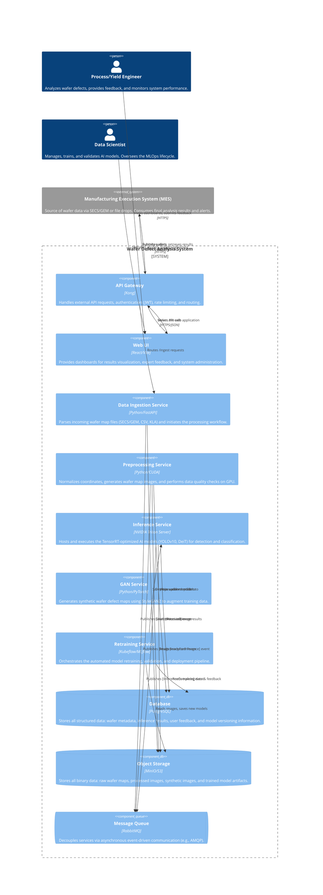
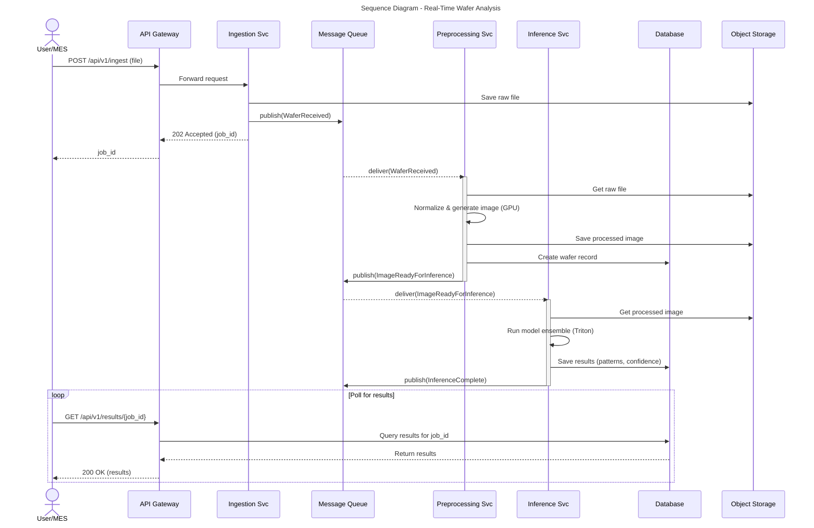
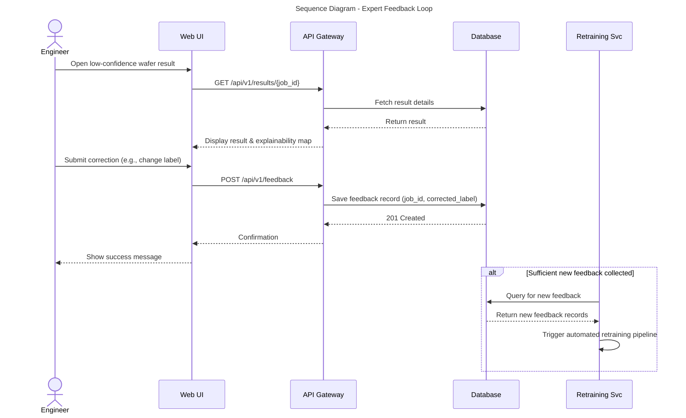
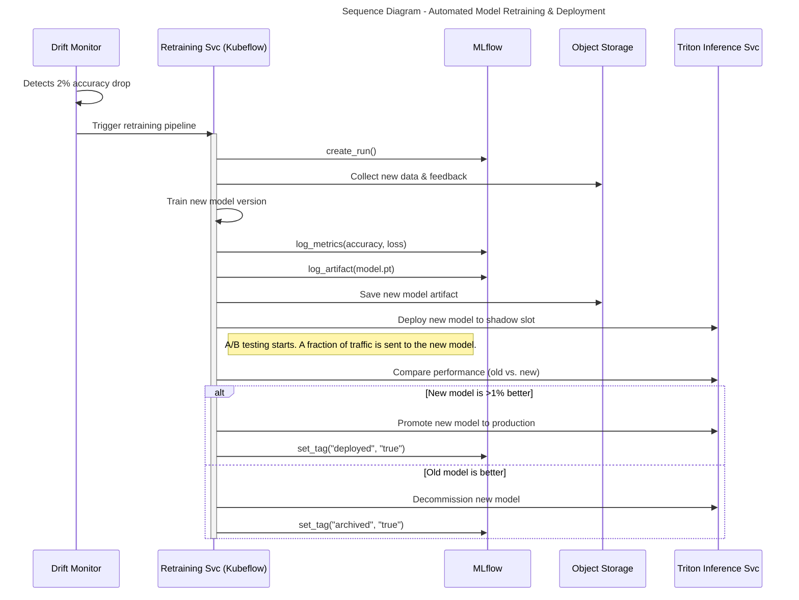

# Wafer Defect Analysis System - Detailed Design Specification

**Document Version:** 2.0

**Author:** Manus AI

**Date:** January 17, 2026

**Status:** Final

---

## 1. Introduction

This document provides the detailed technical design and architecture for the AI-driven Wafer Defect Analysis System. It serves as the engineering blueprint for development, translating the functional and non-functional requirements into concrete implementation details. The design prioritizes scalability, resilience, maintainability, and performance to meet the demanding needs of a high-volume semiconductor manufacturing environment.

All diagrams within this document are rendered using Mermaid syntax to ensure they are version-controlled and easily updatable alongside the code and documentation.

---

## 2. System Architecture

### 2.1. Component Architecture (C4 Model - Level 2)

**Requirement ID**: D-ARCH-01

This diagram illustrates the major components of the system, their primary responsibilities, the technology choices, and the high-level interactions between them. The architecture is based on a microservices pattern, where each service is a self-contained component deployed independently.



---

## 3. Data Flow Diagrams

### 3.1. Context Diagram (Level 0)

**Requirement ID**: D-DFD-01

This diagram shows the system as a single black box, illustrating its boundaries and high-level interactions with external entities.

```mermaid
--- 
title: Data Flow Diagram (Level 0 - Context)
--- 
graph TD
    subgraph External Entities
        A[Manufacturing Execution System <br/> (MES)]
        B[Process/Yield Engineer]
        C[Data Scientist]
    end

    subgraph System
        P1(Wafer Defect <br/> Analysis System)
    end

    A -- "Wafer Map Data (SECS/GEM, Files)" --> P1
    P1 -- "Analysis Results & Alerts" --> A

    B -- "Feedback & Corrections" --> P1
    P1 -- "Dashboards & Visualizations" --> B

    C -- "Model Management Commands" --> P1
    P1 -- "Training Logs & Performance Metrics" --> C
```

### 3.2. Real-Time Inference Data Flow (Level 1)

**Requirement ID**: D-DFD-02

This diagram details the flow of data between components during the real-time analysis of a single wafer.

```mermaid
--- 
title: Data Flow Diagram (Level 1 - Real-Time Inference)
--- 
graph TD
    A[External Source <br/> (MES/User)] -- "Wafer Map File" --> P1(1.0 Ingest Data)
    
    P1 -- "Raw Wafer Map" --> D1[D1: Object Storage <br/> (raw-wafer-maps)]
    P1 -- "New Wafer Event" --> P2(2.0 Preprocess Wafer)
    
    P2 -- "Raw Wafer Map" --> D1
    P2 -- "Processed Image & Metadata" --> D2[D2: Object Storage <br/> (processed-images)]
    P2 -- "Wafer Record" --> D3[D3: Database <br/> (wafers table)]
    P2 -- "Image Ready Event" --> P3(3.0 Perform Inference)
    
    P3 -- "Processed Image" --> D2
    P3 -- "AI Models" --> D4[D4: Object Storage <br/> (model-artifacts)]
    P3 -- "Inference Result" --> D3
    P3 -- "Result Ready Event" --> P4(4.0 Publish Results)
    
    P4 -- "Inference Result" --> D3
    P4 -- "Final Result & Alert" --> E1[External Sink <br/> (MES/User)]
```

### 3.3. Model Retraining Data Flow (Level 1)

**Requirement ID**: D-DFD-03

This diagram illustrates the data flow during the automated model retraining workflow, from data collection to deployment.

```mermaid
--- 
title: Data Flow Diagram (Level 1 - Model Retraining)
--- 
graph TD
    D1[D1: Database <br/> (wafers, user_feedback)] -- "New Labeled Data & Feedback" --> P1(1.0 Collect Training Data)
    D2[D2: Object Storage <br/> (processed-images)] -- "Existing Images" --> P1
    
    P1 -- "Curated Training Set" --> D3[D3: Object Storage <br/> (training-datasets)]
    P1 -- "Training Job Request" --> P2(2.0 Train & Validate Model)
    
    P2 -- "Training Set" --> D3
    P2 -- "Synthetic Data Request" --> P3(3.0 Generate Synthetic Data)
    P3 -- "Synthetic Images" --> D2
    
    P2 -- "Training Logs & Metrics" --> D4[D4: Database <br/> (mlflow_runs)]
    P2 -- "New Model Artifact" --> D5[D5: Object Storage <br/> (model-artifacts)]
    P2 -- "Validation Complete Event" --> P4(4.0 Deploy Model)
    
    P4 -- "New Model Artifact" --> D5
    P4 -- "Deployment Status" --> D1
    P4 -- "Updated Model" --> E1[Inference Service]
```

---

## 4. Sequence Diagrams

### 4.1. Real-Time Wafer Analysis Sequence

**Requirement ID**: D-SEQ-01

This diagram shows the chronological sequence of interactions between components when a new wafer is submitted for analysis.



### 4.2. Expert Feedback and Active Learning Sequence

**Requirement ID**: D-SEQ-02

This diagram details the process of an engineer providing feedback on a classification, which is then used for active learning.



### 4.3. Automated Model Retraining and Deployment Sequence

**Requirement ID**: D-SEQ-03

This diagram illustrates the MLOps pipeline for automatically retraining, validating, and deploying an improved model.



---

## 5. Data Model

### 5.1. Entity-Relationship Diagram (ERD)

**Requirement ID**: D-ERD-01

This ERD outlines the schema for the PostgreSQL database, defining the core tables and their relationships.

```mermaid
--- 
title: Database Schema - Entity-Relationship Diagram
--- 
erDiagram
    users {
        INTEGER id PK
        VARCHAR(255) username
        VARCHAR(255) hashed_password
        INTEGER role_id FK
        TIMESTAMP created_at
    }

    roles {
        INTEGER id PK
        VARCHAR(50) name UNIQUE
    }

    wafers {
        INTEGER id PK
        VARCHAR(50) lot_id
        INTEGER wafer_number
        VARCHAR(100) process_step
        VARCHAR(100) equipment_id
        TIMESTAMP inspection_timestamp
        JSONB metadata
        VARCHAR(255) raw_file_path
        VARCHAR(255) processed_image_path
    }

    inference_results {
        INTEGER id PK
        INTEGER wafer_id FK
        INTEGER model_version_id FK
        VARCHAR(50) primary_pattern
        FLOAT confidence
        JSONB all_detected_patterns
        JSONB root_cause_analysis
        TIMESTAMP created_at
    }

    user_feedback {
        INTEGER id PK
        INTEGER result_id FK
        INTEGER user_id FK
        VARCHAR(50) corrected_pattern
        TEXT notes
        TIMESTAMP created_at
    }

    model_versions {
        INTEGER id PK
        VARCHAR(20) version_string
        VARCHAR(255) model_path
        JSONB hyperparameters
        JSONB performance_metrics
        INTEGER dataset_id FK
        TIMESTAMP created_at
    }

    training_datasets {
        INTEGER id PK
        VARCHAR(20) version_string
        INTEGER real_sample_count
        INTEGER synthetic_sample_count
        JSONB class_distribution
        TIMESTAMP created_at
    }

    users ||--o{ roles : "has"
    wafers ||--|{ inference_results : "has"
    inference_results ||--o{ user_feedback : "receives"
    user_feedback }|--|| users : "is given by"
    model_versions ||--|{ inference_results : "produces"
    training_datasets ||--o{ model_versions : "is used by"
```

---

## 6. Deployment Architecture

### 6.1. Kubernetes Deployment Diagram

**Requirement ID**: D-DEPLOY-01

This diagram illustrates how the microservices are deployed as pods within a Kubernetes cluster, distributed across CPU and GPU nodes.

```mermaid
--- 
title: Kubernetes Deployment Architecture
--- 
graph TD
    subgraph Internet/Fab Network
        direction LR
        A[User/MES]
    end

    subgraph Kubernetes Cluster
        B(Ingress Controller) --> C{API Gateway Service}

        subgraph CPU Node 1
            D1[Pod: API Gateway]
            D2[Pod: Web UI]
            D3[Pod: Ingestion Svc]
        end

        subgraph CPU Node 2
            E1[Pod: Retraining Svc]
            E2[Pod: RabbitMQ]
            E3[Pod: PostgreSQL]
        end

        subgraph GPU Node 1 (NVIDIA H100)
            F1[Pod: Preprocessing Svc]
            F2[Pod: Inference Svc (Triton)]
        end

        subgraph GPU Node 2 (NVIDIA H100)
            G1[Pod: Preprocessing Svc]
            G2[Pod: Inference Svc (Triton)]
        end

        C --> D1
        C --> D2
        C --> D3

        E2 -- "Persistent Volume" --> H1(PV/StorageClass)
        E3 -- "Persistent Volume" --> H1

        F1 -- "GPU Access" --> I1(NVIDIA Device Plugin)
        F2 -- "GPU Access" --> I1
        G1 -- "GPU Access" --> I1
        G2 -- "GPU Access" --> I1
    end

    subgraph Cloud/On-Prem Services
        J[Object Storage (S3/MinIO)]
    end

    A --> B
    D3 -.-> J
    F1 -.-> J
    G1 -.-> J
    F2 -.-> J
    G2 -.-> J
```

This detailed design specification provides a complete blueprint for the development team, covering all critical aspects of the system from high-level architecture to low-level data models and deployment strategies.
