# Design Document: Wafer Defect Pattern Recognition System

## Overview

This design document details the architecture and implementation approach for an AI-powered semiconductor wafer defect pattern recognition system. The system leverages deep learning for pattern classification and employs Generative Adversarial Networks (GANs) along with advanced augmentation techniques to address the critical challenge of limited training data in semiconductor manufacturing.

The architecture follows a modular, microservices-based approach enabling independent scaling of data ingestion, model training, synthetic data generation, and inference components. The design prioritizes production readiness with sub-5-second inference latency, enterprise integration capabilities, and continuous learning mechanisms.

### Key Design Principles

1. **Modularity**: Separate concerns for data processing, model training, inference, and synthetic data generation
2. **Scalability**: Horizontal scaling through containerization and distributed processing
3. **Extensibility**: Plugin architecture for new defect patterns, data formats, and model architectures
4. **Observability**: Comprehensive logging, metrics, and tracing for production monitoring
5. **Data Quality**: Rigorous validation of both real and synthetic data to ensure model reliability

## Architecture

### High-Level System Architecture

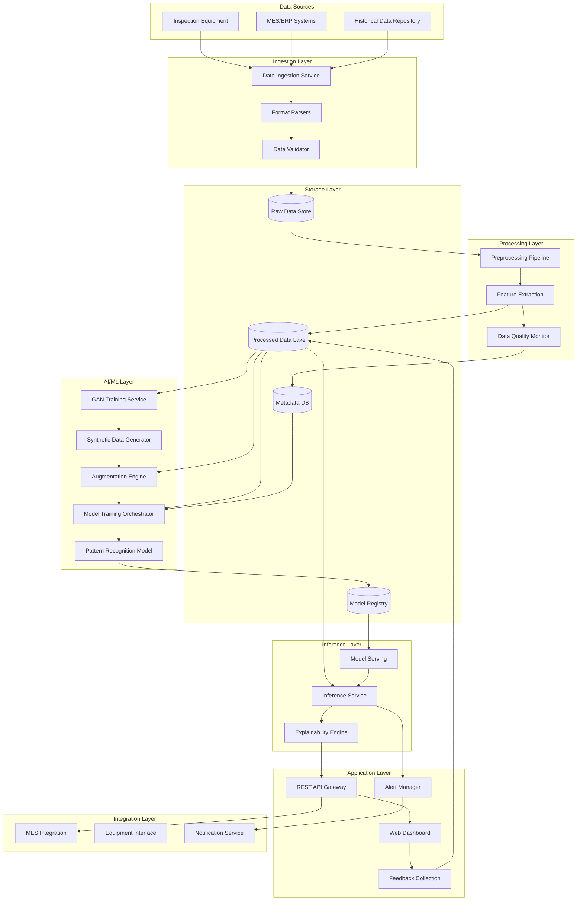

### Deployment Architecture

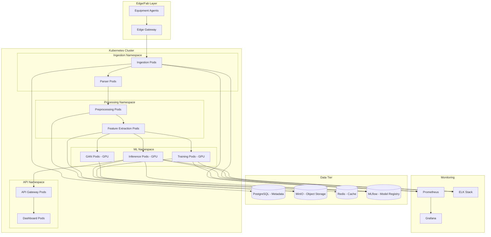

## Components and Interfaces

### 1. Data Ingestion Service

**Purpose**: Receive wafer map data from multiple sources and formats, validate, and route to processing pipeline.

**Technology Stack**: Python (FastAPI), Apache Kafka for message queuing

**Key Responsibilities**:
- Multi-format parser support (SEMI SECS/GEM, CSV, STDF, proprietary formats)
- Schema validation and data quality checks
- Metadata extraction (lot ID, wafer ID, timestamp, process step)
- Asynchronous processing with retry logic

**Interface Specification**:
```python
class WaferMapIngestionAPI:
    def upload_wafer_map(
        file: UploadFile,
        format: str,
        metadata: Dict[str, Any]
    ) -> IngestionResponse
    
    def batch_upload(
        files: List[UploadFile],
        format: str
    ) -> BatchIngestionResponse
    
    def get_ingestion_status(
        job_id: str
    ) -> IngestionStatus
```

**Data Flow**:
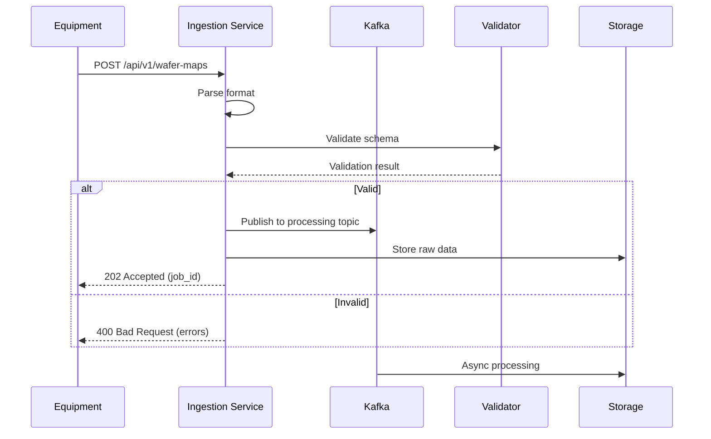

### 2. Preprocessing Pipeline

**Purpose**: Normalize wafer map data, extract features, and prepare for model training/inference.

**Technology Stack**: Python (NumPy, SciPy, OpenCV), Apache Spark for batch processing

**Key Responsibilities**:
- Coordinate system normalization (notch alignment, die indexing)
- Defect map generation from die-level data
- Image representation creation (binary masks, heatmaps, multi-channel encodings)
- Feature extraction (spatial statistics, defect density, pattern descriptors)
- Data augmentation application

**Processing Pipeline**:
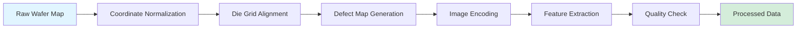

**Data Structures**:
```python
@dataclass
class WaferMap:
    wafer_id: str
    lot_id: str
    process_step: str
    timestamp: datetime
    die_grid: np.ndarray  # 2D array of die status
    defect_coordinates: List[Tuple[int, int]]
    bin_codes: Dict[Tuple[int, int], int]
    metadata: Dict[str, Any]

@dataclass
class ProcessedWaferMap:
    wafer_map: WaferMap
    normalized_image: np.ndarray  # (H, W, C) tensor
    defect_density_map: np.ndarray
    spatial_features: Dict[str, float]
    pattern_descriptors: np.ndarray
```

### 3. GAN-Based Synthetic Data Generator

**Purpose**: Generate realistic synthetic wafer defect maps to augment training data for underrepresented defect patterns.

**Technology Stack**: PyTorch, CUDA, Weights & Biases for experiment tracking

**Architecture**: Conditional Wasserstein GAN with Gradient Penalty (CWGAN-GP)

**Design Rationale**:
- WGAN-GP provides stable training and better mode coverage than vanilla GANs
- Conditional generation allows control over defect pattern type and characteristics
- Gradient penalty ensures Lipschitz constraint without weight clipping

**GAN Architecture**:
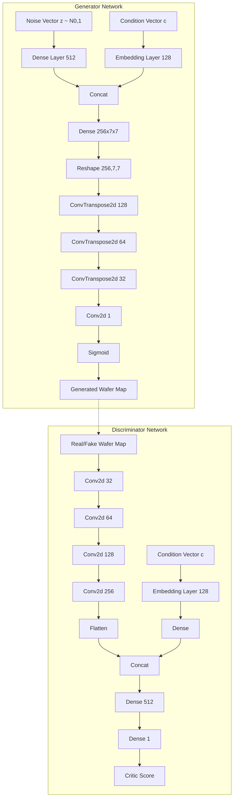

**Conditioning Strategy**:

```python
class ConditionalVector:
    pattern_type: OneHotEncoded  # 10 classes
    defect_density: float  # [0, 1]
    spatial_distribution: Enum  # center, edge, random, clustered
    severity: float  # [0, 1]
```

**Training Process**:
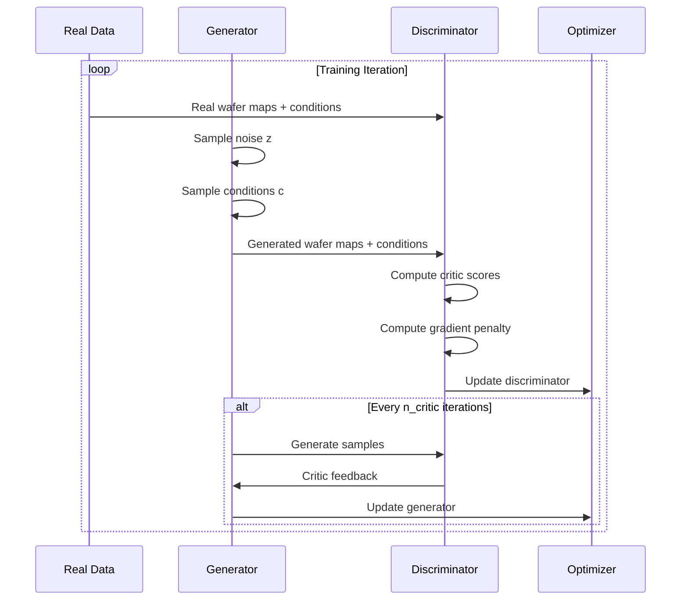

**Quality Validation Metrics**:
- Fréchet Inception Distance (FID): Measures distribution similarity
- Structural Similarity Index (SSIM): Validates spatial coherence
- Defect Pattern Classifier Score: Uses pre-trained classifier to verify pattern fidelity
- Physical Plausibility Checks: Edge exclusion zones, die grid alignment, defect clustering statistics

### 4. Advanced Augmentation Engine

**Purpose**: Apply diverse augmentation strategies to expand training data diversity beyond GAN generation.

**Augmentation Pipeline**:
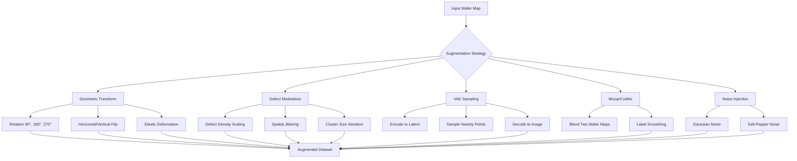

**Augmentation Configuration**:
```python
class AugmentationConfig:
    geometric_prob: float = 0.5
    rotation_angles: List[int] = [0, 90, 180, 270]
    flip_horizontal: bool = True
    flip_vertical: bool = True
    
    defect_modulation_prob: float = 0.3
    density_scale_range: Tuple[float, float] = (0.8, 1.2)
    spatial_jitter_pixels: int = 2
    
    vae_sampling_prob: float = 0.2
    vae_latent_std: float = 0.1
    
    mixup_prob: float = 0.15
    mixup_alpha: float = 0.4
    
    noise_prob: float = 0.1
    noise_std: float = 0.02
```

### 5. Pattern Recognition Model

**Purpose**: Classify defect patterns and predict root cause categories with high accuracy and explainability.

**Model Architecture**: EfficientNet-B3 with custom classification head

**Design Rationale**:
- EfficientNet provides excellent accuracy-efficiency tradeoff
- Compound scaling balances depth, width, and resolution
- Transfer learning from ImageNet provides strong feature extraction baseline
- Custom head adapts to semiconductor-specific patterns

**Network Architecture**:
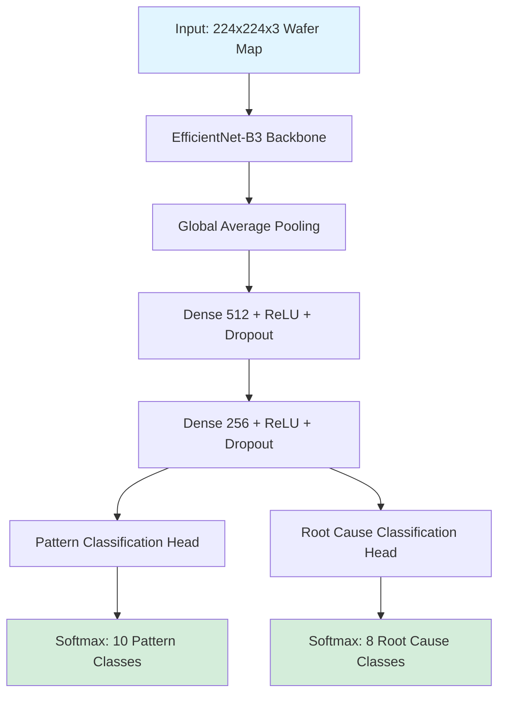

**Multi-Task Learning**:
```python
class WaferDefectModel(nn.Module):
    def __init__(self):
        self.backbone = EfficientNet.from_pretrained('efficientnet-b3')
        self.shared_head = nn.Sequential(
            nn.Linear(1536, 512),
            nn.ReLU(),
            nn.Dropout(0.3),
            nn.Linear(512, 256),
            nn.ReLU(),
            nn.Dropout(0.2)
        )
        self.pattern_classifier = nn.Linear(256, 10)
        self.root_cause_classifier = nn.Linear(256, 8)
    
    def forward(self, x):
        features = self.backbone.extract_features(x)
        pooled = F.adaptive_avg_pool2d(features, 1).flatten(1)
        shared = self.shared_head(pooled)
        pattern_logits = self.pattern_classifier(shared)
        root_cause_logits = self.root_cause_classifier(shared)
        return pattern_logits, root_cause_logits
```

**Loss Function**:
```python
# Combined loss with class balancing
loss = (
    alpha * focal_loss(pattern_logits, pattern_labels) +
    beta * focal_loss(root_cause_logits, root_cause_labels) +
    gamma * consistency_loss(pattern_logits, root_cause_logits)
)
```

### 6. Training Orchestrator

**Purpose**: Manage end-to-end training workflows including data preparation, augmentation, model training, and validation.

**Training Workflow**:
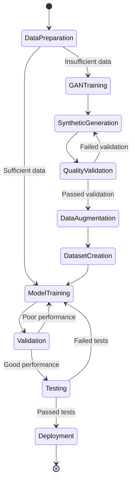

**Training Configuration**:

```python
class TrainingConfig:
    # Data configuration
    train_split: float = 0.7
    val_split: float = 0.15
    test_split: float = 0.15
    synthetic_ratio: float = 0.3  # 30% synthetic data
    
    # Model configuration
    model_architecture: str = "efficientnet-b3"
    pretrained: bool = True
    num_pattern_classes: int = 10
    num_root_cause_classes: int = 8
    
    # Training hyperparameters
    batch_size: int = 32
    learning_rate: float = 1e-4
    optimizer: str = "AdamW"
    scheduler: str = "CosineAnnealingWarmRestarts"
    epochs: int = 100
    early_stopping_patience: int = 15
    
    # Loss configuration
    pattern_loss_weight: float = 1.0
    root_cause_loss_weight: float = 0.8
    consistency_loss_weight: float = 0.2
    focal_loss_gamma: float = 2.0
    
    # Augmentation
    augmentation_config: AugmentationConfig
```

### 7. Inference Service

**Purpose**: Provide low-latency, high-throughput defect pattern classification for production wafers.

**Inference Pipeline**:
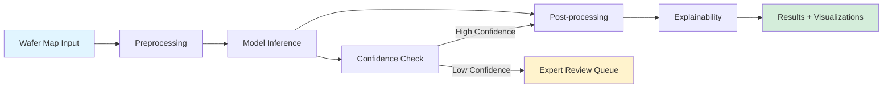

**Optimization Strategies**:
- Model quantization (INT8) using TensorRT for 3-4x speedup
- ONNX export for cross-platform deployment
- Batch inference for throughput optimization
- Model caching and warm-up for reduced cold-start latency
- GPU memory management for concurrent requests

**API Interface**:
```python
class InferenceAPI:
    def predict_single(
        wafer_map: WaferMapInput,
        explain: bool = False
    ) -> PredictionResult
    
    def predict_batch(
        wafer_maps: List[WaferMapInput],
        explain: bool = False
    ) -> List[PredictionResult]
    
    def get_similar_cases(
        wafer_id: str,
        top_k: int = 5
    ) -> List[SimilarCase]

@dataclass
class PredictionResult:
    wafer_id: str
    pattern_class: str
    pattern_confidence: float
    root_cause_class: str
    root_cause_confidence: float
    defect_heatmap: np.ndarray
    explanation: Optional[ExplanationResult]
    processing_time_ms: float
```

### 8. Explainability Engine

**Purpose**: Provide interpretable explanations for model predictions to build trust and enable root cause analysis.

**Explainability Techniques**:
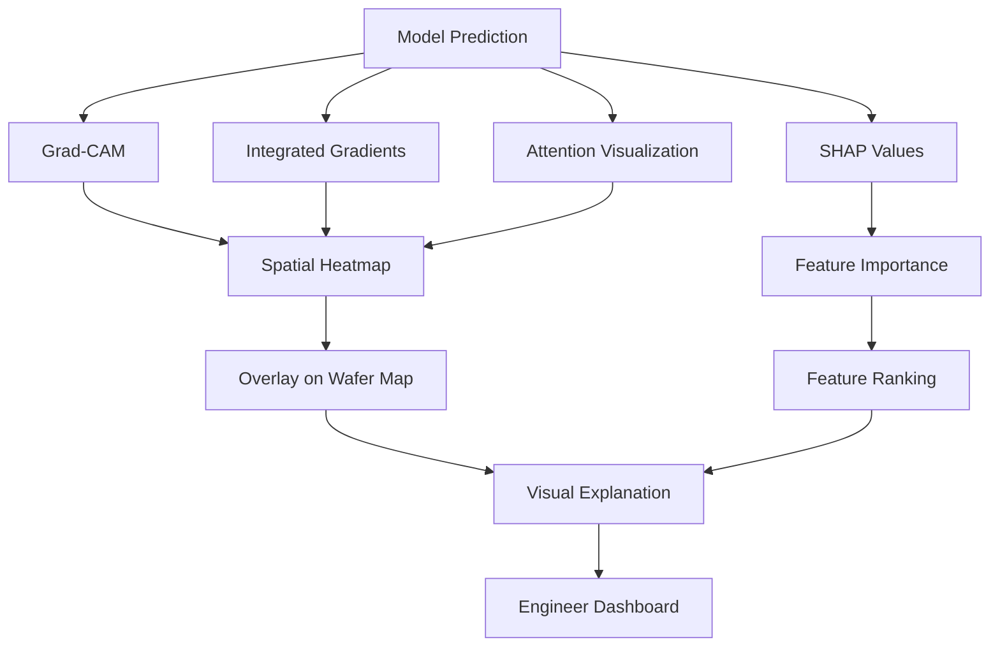

**Grad-CAM Implementation**:
```python
class GradCAMExplainer:
    def __init__(self, model, target_layer):
        self.model = model
        self.target_layer = target_layer
        self.gradients = None
        self.activations = None
        
    def generate_heatmap(self, input_tensor, class_idx):
        # Forward pass
        output = self.model(input_tensor)
        
        # Backward pass
        self.model.zero_grad()
        output[0, class_idx].backward()
        
        # Generate heatmap
        gradients = self.gradients
        activations = self.activations
        weights = torch.mean(gradients, dim=(2, 3), keepdim=True)
        heatmap = torch.sum(weights * activations, dim=1)
        heatmap = F.relu(heatmap)
        heatmap = F.interpolate(heatmap, size=input_tensor.shape[2:])
        
        return heatmap
```

### 9. Continuous Learning System

**Purpose**: Enable model improvement through feedback loops and automated retraining.

**Continuous Learning Workflow**:
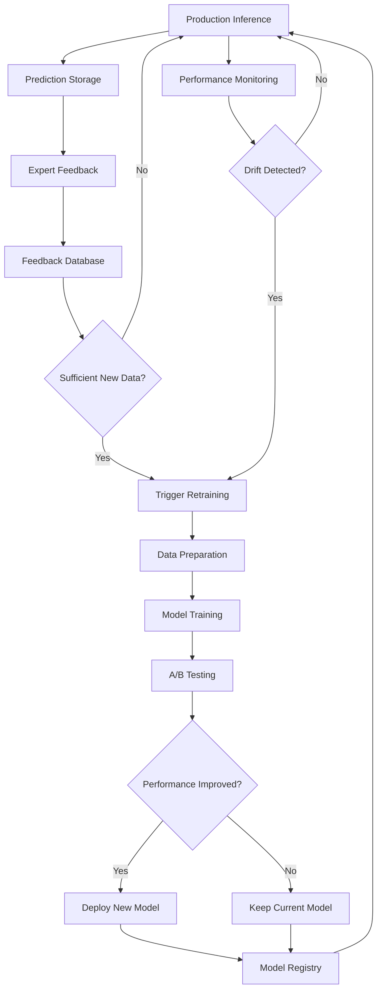

**Active Learning Strategy**:
```python
class ActiveLearningSelector:
    def select_samples_for_labeling(
        self,
        unlabeled_pool: List[WaferMap],
        budget: int
    ) -> List[WaferMap]:
        # Uncertainty sampling
        uncertainties = self.compute_prediction_entropy(unlabeled_pool)
        
        # Diversity sampling
        embeddings = self.extract_embeddings(unlabeled_pool)
        diverse_samples = self.k_center_greedy(embeddings, budget // 2)
        
        # Combine strategies
        uncertain_samples = self.top_k(uncertainties, budget // 2)
        
        return uncertain_samples + diverse_samples
```

## Data Models

### Core Data Structures

```python
# Wafer Map Data Model
class WaferMapEntity:
    id: UUID
    wafer_id: str
    lot_id: str
    process_step: str
    equipment_id: str
    timestamp: datetime
    die_count_x: int
    die_count_y: int
    defect_data: bytes  # Compressed binary representation
    metadata: JSONB
    created_at: datetime
    updated_at: datetime

# Processed Wafer Map
class ProcessedWaferMapEntity:
    id: UUID
    wafer_map_id: UUID
    image_path: str  # Object storage path
    features: JSONB
    pattern_labels: List[str]  # Ground truth if available
    root_cause_labels: List[str]
    is_synthetic: bool
    generation_method: Optional[str]
    quality_score: Optional[float]
    created_at: datetime

# Prediction Result
class PredictionEntity:
    id: UUID
    wafer_map_id: UUID
    model_version: str
    pattern_prediction: str
    pattern_confidence: float
    root_cause_prediction: str
    root_cause_confidence: float
    inference_time_ms: float
    explanation_path: Optional[str]
    created_at: datetime

# Feedback
class FeedbackEntity:
    id: UUID
    prediction_id: UUID
    user_id: str
    correct_pattern: Optional[str]
    correct_root_cause: Optional[str]
    comments: str
    created_at: datetime

# Model Metadata
class ModelEntity:
    id: UUID
    version: str
    architecture: str
    training_config: JSONB
    metrics: JSONB
    artifact_path: str
    is_production: bool
    created_at: datetime
    deployed_at: Optional[datetime]
```

### Database Schema

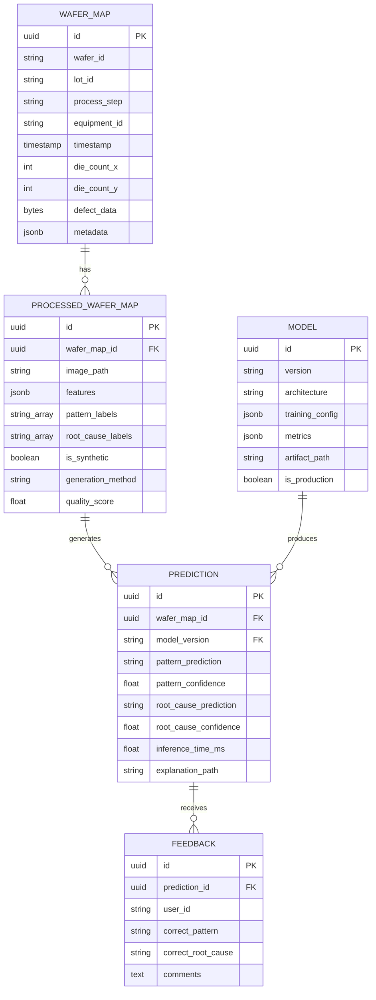

## Error Handling

### Error Classification and Recovery Strategies

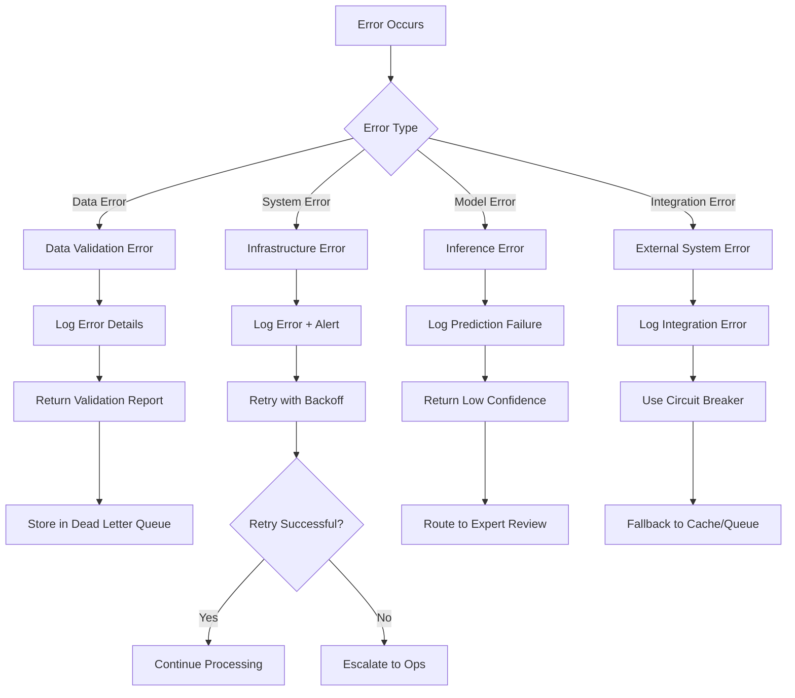

### Error Handling Patterns

```python
class ErrorHandler:
    @retry(
        stop=stop_after_attempt(3),
        wait=wait_exponential(multiplier=1, min=4, max=10),
        retry=retry_if_exception_type(TransientError)
    )
    def process_with_retry(self, wafer_map):
        try:
            return self.process(wafer_map)
        except ValidationError as e:
            logger.error(f"Validation failed: {e}")
            self.send_to_dead_letter_queue(wafer_map, e)
            raise
        except InferenceError as e:
            logger.warning(f"Inference failed: {e}")
            return self.create_low_confidence_result(wafer_map)
        except Exception as e:
            logger.critical(f"Unexpected error: {e}")
            self.alert_ops_team(e)
            raise

class CircuitBreaker:
    def __init__(self, failure_threshold=5, timeout=60):
        self.failure_count = 0
        self.failure_threshold = failure_threshold
        self.timeout = timeout
        self.last_failure_time = None
        self.state = "CLOSED"
    
    def call(self, func, *args, **kwargs):
        if self.state == "OPEN":
            if time.time() - self.last_failure_time > self.timeout:
                self.state = "HALF_OPEN"
            else:
                raise CircuitBreakerOpenError()
        
        try:
            result = func(*args, **kwargs)
            self.on_success()
            return result
        except Exception as e:
            self.on_failure()
            raise
```

## Testing Strategy

### Testing Pyramid

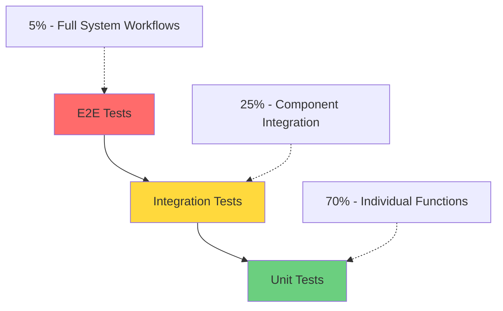

### Test Coverage Strategy

**Unit Tests (70%)**:
- Data preprocessing functions
- Augmentation transformations
- Model forward/backward passes
- Utility functions
- Validation logic

**Integration Tests (25%)**:
- Data pipeline end-to-end
- GAN training workflow
- Model training workflow
- API endpoints
- Database operations

**End-to-End Tests (5%)**:
- Complete inference workflow
- Continuous learning cycle
- MES integration scenarios
- Alert and notification flows

### Model Testing Approach

```python
class ModelTestSuite:
    def test_model_accuracy(self):
        # Test on held-out test set
        assert accuracy > 0.95
        assert per_class_recall > 0.90
    
    def test_synthetic_data_quality(self):
        # Validate GAN outputs
        fid_score = compute_fid(real_data, synthetic_data)
        assert fid_score < 50
    
    def test_inference_latency(self):
        # Performance test
        latency = measure_inference_time(wafer_map)
        assert latency < 5000  # 5 seconds
    
    def test_model_robustness(self):
        # Adversarial testing
        perturbed = add_noise(wafer_map, epsilon=0.1)
        pred_original = model(wafer_map)
        pred_perturbed = model(perturbed)
        assert cosine_similarity(pred_original, pred_perturbed) > 0.9
    
    def test_explainability(self):
        # Verify explanations are generated
        result = inference_service.predict(wafer_map, explain=True)
        assert result.explanation is not None
        assert result.explanation.heatmap.shape == wafer_map.shape
```

### Data Quality Testing

```python
class DataQualityTests:
    def test_wafer_map_validity(self, wafer_map):
        # Schema validation
        assert wafer_map.die_count_x > 0
        assert wafer_map.die_count_y > 0
        assert len(wafer_map.defect_coordinates) >= 0
        
        # Coordinate bounds
        for x, y in wafer_map.defect_coordinates:
            assert 0 <= x < wafer_map.die_count_x
            assert 0 <= y < wafer_map.die_count_y
    
    def test_synthetic_data_plausibility(self, synthetic_map):
        # Physical constraints
        assert self.check_edge_exclusion(synthetic_map)
        assert self.check_defect_clustering(synthetic_map)
        assert self.check_density_range(synthetic_map)
```

## Performance Optimization

### Inference Optimization

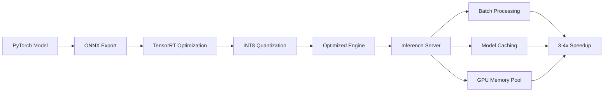

### Training Optimization

- Mixed precision training (FP16) for 2x speedup
- Distributed data parallel (DDP) for multi-GPU training
- Gradient accumulation for large effective batch sizes
- Efficient data loading with prefetching and multi-worker DataLoader
- Model checkpointing and resume capability

### Storage Optimization

- Wafer map compression (PNG with lossless compression)
- Feature vector quantization
- Time-series data aggregation
- Automated data lifecycle management (hot/warm/cold storage tiers)

## Security Considerations

### Authentication and Authorization

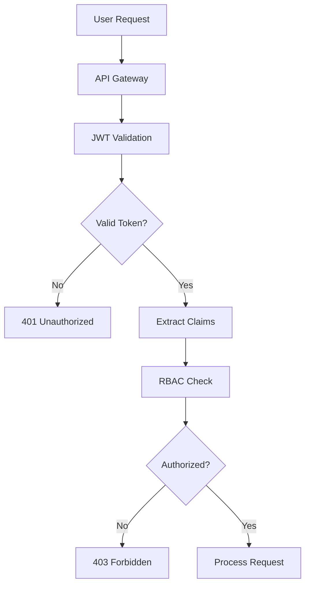

### Data Protection

- Encryption at rest (AES-256) for sensitive wafer data
- Encryption in transit (TLS 1.3) for all API communications
- Data anonymization for synthetic data generation
- Access logging and audit trails
- Secure model artifact storage with versioning

### Compliance

- SEMI standards compliance for data formats
- ISO 9001 quality management alignment
- GDPR considerations for user data
- Export control compliance (ITAR if applicable)

## Monitoring and Observability

### Metrics Collection

```python
# Key Performance Indicators
class SystemMetrics:
    # Throughput metrics
    wafers_processed_per_hour: Counter
    inference_requests_per_second: Gauge
    
    # Latency metrics
    inference_latency_ms: Histogram
    end_to_end_latency_ms: Histogram
    
    # Model metrics
    prediction_confidence: Histogram
    pattern_class_distribution: Counter
    model_accuracy: Gauge
    
    # Data metrics
    synthetic_data_ratio: Gauge
    data_quality_score: Gauge
    
    # System metrics
    gpu_utilization: Gauge
    memory_usage: Gauge
    error_rate: Counter
```

### Alerting Rules

```yaml
alerts:
  - name: HighInferenceLatency
    condition: inference_latency_p95 > 5000ms
    severity: warning
    
  - name: LowModelConfidence
    condition: avg(prediction_confidence) < 0.7
    severity: warning
    
  - name: ModelDriftDetected
    condition: accuracy_drop > 5%
    severity: critical
    
  - name: HighErrorRate
    condition: error_rate > 1%
    severity: critical
    
  - name: GPUMemoryExhaustion
    condition: gpu_memory_usage > 90%
    severity: warning
```

### Logging Strategy

```python
# Structured logging
logger.info(
    "Inference completed",
    extra={
        "wafer_id": wafer_id,
        "model_version": model_version,
        "pattern_prediction": pattern,
        "confidence": confidence,
        "latency_ms": latency,
        "timestamp": datetime.utcnow().isoformat()
    }
)
```

## Deployment Strategy

### Blue-Green Deployment

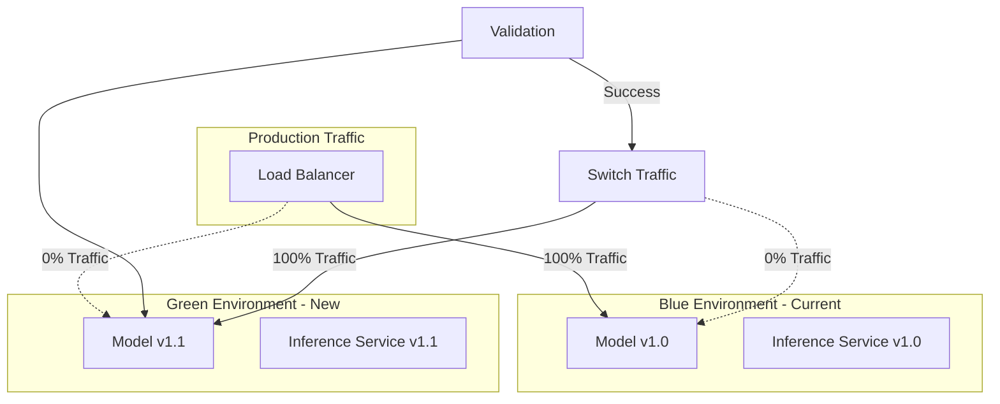

### Canary Deployment for Model Updates

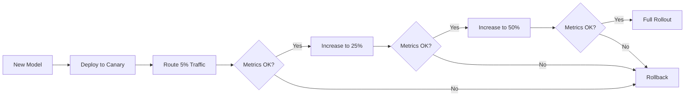

This design provides a production-ready, scalable architecture for semiconductor wafer defect pattern recognition with comprehensive AI-powered data augmentation capabilities. The system addresses real-world manufacturing challenges while maintaining high accuracy, low latency, and continuous improvement capabilities.
