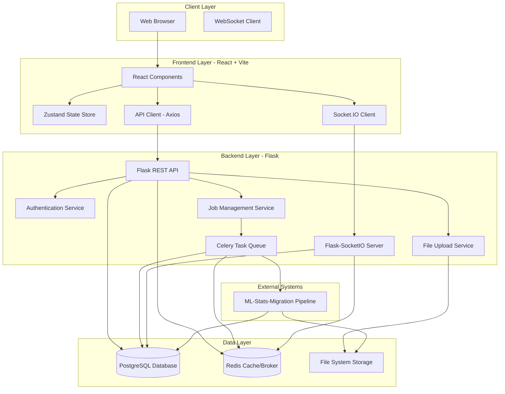

# Design Document: ML Analysis Web Dashboard

## Overview

The ML Analysis Web Dashboard is a full-stack web application that provides a professional interface for managing ML-powered factor ranking analysis jobs in semiconductor wafer manufacturing. The system consists of three main layers:

1. **Frontend Layer**: React 18 + Vite application with TypeScript, providing interactive UI components, real-time updates, and rich data visualizations
2. **Backend Layer**: Python Flask RESTful API with WebSocket support, handling business logic, authentication, and integration with the ML pipeline
3. **Data Layer**: PostgreSQL relational database for persistent storage, Redis for caching and message brokering, and file system storage for uploaded CSV files

The application integrates with the existing ML-Stats-Migration backend (Python ML pipeline) to execute analysis jobs and retrieve results. Real-time communication is achieved through WebSocket connections, allowing users to monitor job progress without page refreshes.

### Technology Stack

- **Frontend**: React 18, TypeScript, Vite, TanStack Query, Zustand (state management), Socket.IO Client, Recharts/Plotly.js (visualizations), AG-Grid (data grid)
- **Backend**: Python 3.11+, Flask 3.0, Flask-SocketIO, SQLAlchemy 2.0, Celery 5.3, Redis 7.0
- **Database**: PostgreSQL 15+, Redis 7.0
- **Infrastructure**: Nginx (reverse proxy), Gunicorn (WSGI server), Docker (containerization)

## Architecture


### System Architecture Diagram



### Request Flow Patterns

**Pattern 1: Job Creation Flow**
1. User submits job creation form in React UI
2. Frontend validates input and sends POST request to `/api/v1/jobs`
3. Flask API validates request, creates job record in PostgreSQL
4. API returns job ID and status to frontend
5. Frontend navigates to job detail page

**Pattern 2: File Upload Flow**
1. User selects files in upload component
2. Frontend sends multipart/form-data POST to `/api/v1/jobs/{job_id}/files`
3. Flask validates file format and size
4. Flask saves file to file system and creates job_files record
5. When all required files uploaded, Flask enqueues Celery task to start ML pipeline
6. API returns upload status to frontend

**Pattern 3: Real-Time Job Monitoring Flow**
1. User opens job detail page
2. Frontend establishes WebSocket connection via Socket.IO
3. Frontend subscribes to job-specific room: `job:{job_id}`
4. Celery worker executes ML pipeline and updates job status in PostgreSQL
5. Celery worker emits status update to Redis pub/sub channel
6. Flask-SocketIO receives Redis message and broadcasts to WebSocket room
7. Frontend receives WebSocket message and updates UI reactively

**Pattern 4: Results Retrieval Flow**
1. User navigates to results page for completed job
2. Frontend sends GET request to `/api/v1/jobs/{job_id}/results`
3. Flask checks Redis cache for results
4. If cache miss, Flask queries PostgreSQL results table
5. Flask caches results in Redis with 5-minute TTL
6. API returns JSON results to frontend
7. Frontend renders data grid and visualizations

## Components and Interfaces

### Frontend Components


#### Core UI Components

**1. JobCreationForm Component**
```typescript
interface JobCreationFormProps {
  onSubmit: (data: JobCreationData) => Promise<void>;
  analysisTypes: AnalysisType[];
}

interface JobCreationData {
  jobName: string;
  description: string;
  analysisType: string;
  notificationPreferences: {
    email: boolean;
    sms: boolean;
  };
}

// Component renders form with:
// - Job name input (required, max 100 chars)
// - Description textarea (optional, max 500 chars)
// - Analysis type dropdown (6 options)
// - Notification checkboxes
// - Submit button (disabled until valid)
```

**2. FileUploadManager Component**
```typescript
interface FileUploadManagerProps {
  jobId: string;
  requiredFiles: FileRequirement[];
  onUploadComplete: () => void;
}

interface FileRequirement {
  fileName: string;
  pattern: RegExp;
  required: boolean;
  uploaded: boolean;
}

// Component renders:
// - Checklist of required files with status icons
// - Drag-and-drop upload zone
// - Progress bars for active uploads
// - Validation error messages
// - Auto-start indicator when all files ready
```

**3. PipelineMonitor Component**
```typescript
interface PipelineMonitorProps {
  jobId: string;
  realTime: boolean;
}

interface PipelineStatus {
  currentStage: 'input' | 'pipeline' | 'output';
  subStage: string;
  progressPercent: number;
  elapsedTime: number;
  estimatedRemaining: number;
  modelStatuses: ModelStatus[];
}

interface ModelStatus {
  name: 'SHAP' | 'XGBoost' | 'Permutation' | 'MI' | 'LASSO';
  status: 'queued' | 'training' | 'computing' | 'complete' | 'failed';
  metrics?: {
    r2Score?: number;
    accuracy?: number;
    f1Score?: number;
    cvScores?: number[];
    trainingTime?: number;
    numFeatures?: number;
  };
  topFactors?: Array<{ name: string; score: number }>;
}

// Component renders:
// - Pipeline stage diagram with current stage highlighted
// - Progress bar with percentage
// - Elapsed/remaining time display
// - Model status cards (5 cards for 5 models)
// - Real-time updates via WebSocket
```

**4. ResultsDataGrid Component**
```typescript
interface ResultsDataGridProps {
  jobId: string;
  data: FactorRanking[];
  onFactorClick: (factorId: string) => void;
}

interface FactorRanking {
  rank: number;
  factorName: string;
  factorType: 'Equipment' | 'Chamber' | 'Process' | 'Recipe' | 'Test' | 'Metrology';
  ensembleScore: number;
  confidence: number;
  shapScore: number;
  xgboostScore: number;
  permScore: number;
  miScore: number;
  lassoScore: number;
  sampleSize: number;
  effectSize: number;
  marked: boolean;
}

// Component uses AG-Grid with:
// - Column sorting (multi-column)
// - Full-text search filter
// - Factor type filter dropdown
// - Score range slider filter
// - Mark/unmark toggle
// - Export to CSV/Excel buttons
// - Pagination (100 rows per page)
// - Column show/hide menu
// - Column reordering via drag-drop
```

**5. EnsembleBarChart Component**
```typescript
interface EnsembleBarChartProps {
  data: FactorRanking[];
  topN: number;
  onBarClick: (factorName: string) => void;
}

// Component uses Recharts to render:
// - Stacked bar chart with 5 segments per bar
// - Color coding: SHAP=blue, XGBoost=green, Perm=orange, MI=purple, LASSO=red
// - Hover tooltips showing model name and score
// - Click handler for drill-down
// - Export to PNG/SVG button
// - Responsive sizing
```

**6. ExecutiveDashboard Component**
```typescript
interface ExecutiveDashboardProps {
  jobId: string;
}

interface DashboardData {
  jobSummary: JobSummary;
  topKillers: TopKiller[];
  modelPerformance: ModelPerformance;
  dataQuality: DataQuality;
  historicalComparison?: HistoricalComparison;
}

// Component renders 5 cards:
// - JobSummaryCard: ID, type, status, times, data size
// - TopKillersCard: Top 5 factors with severity indicators
// - ModelPerformanceCard: Agreement score, consensus pie chart
// - DataQualityCard: Completeness %, missing %, outliers
// - HistoricalComparisonCard: Trend vs previous jobs
```

**7. RootCauseAnalysis Component**
```typescript
interface RootCauseAnalysisProps {
  jobId: string;
}

// Component renders sections for each ML model:
// - SHAP section with waterfall, force plot, dependence plot
// - XGBoost section with Gain/Weight/Coverage charts, tree viz
// - Permutation section with bar chart + error bars
// - MI section with sorted bars, interaction heatmap
// - LASSO section with regularization path, coefficient bars
// - Ensemble section with composite chart, confidence gauge
// - Factor type breakdown with severity indicators
// - Actionable recommendations list
```

**8. FactorDetailView Component**
```typescript
interface FactorDetailViewProps {
  jobId: string;
  factorName: string;
}

interface FactorDetail {
  allModelScores: Record<string, number>;
  historicalTrend: Array<{ jobId: string; date: string; score: number }>;
  waferBreakdown: Array<{ waferId: string; lotId: string; impact: number }>;
  relatedFactors: Array<{ name: string; correlation: number }>;
}

// Component renders:
// - Model score comparison table
// - Historical trend line chart
// - Wafer/lot breakdown table
// - Related factors list with correlation
// - Export raw data button
// - Export report button (PDF/PPTX)
```

### Backend Services


#### Flask API Services

**1. Authentication Service**
```python
class AuthService:
    """Handles user authentication and session management"""
    
    def authenticate(username: str, password: str) -> Optional[User]:
        """
        Validates credentials and returns User object if valid.
        Uses bcrypt to verify password hash.
        """
        pass
    
    def create_session(user: User) -> str:
        """
        Creates JWT token valid for 8 hours.
        Token contains: user_id, role, exp timestamp.
        """
        pass
    
    def validate_token(token: str) -> Optional[User]:
        """
        Validates JWT token and returns User if valid.
        Returns None if expired or invalid.
        """
        pass
    
    def check_permission(user: User, resource: str, action: str) -> bool:
        """
        Checks if user role has permission for action on resource.
        Engineer: own jobs only
        Manager: all jobs read-only
        Admin: all permissions
        """
        pass
```

**2. Job Management Service**
```python
class JobService:
    """Handles job lifecycle management"""
    
    def create_job(user_id: int, job_data: JobCreationData) -> Job:
        """
        Creates new job record in database with status 'pending'.
        Validates job name uniqueness for user.
        Returns Job object with generated ID.
        """
        pass
    
    def get_job(job_id: str, user: User) -> Optional[Job]:
        """
        Retrieves job by ID if user has permission.
        Returns None if not found or unauthorized.
        """
        pass
    
    def list_jobs(user: User, filters: JobFilters, page: int, page_size: int) -> JobList:
        """
        Returns paginated list of jobs based on filters.
        Filters: status, analysis_type, date_range, search_query.
        Applies permission checks based on user role.
        """
        pass
    
    def update_job_status(job_id: str, status: JobStatus, stage_info: Optional[StageInfo]) -> None:
        """
        Updates job status and optionally stage information.
        Creates job_status_history record.
        Emits WebSocket event to notify connected clients.
        """
        pass
    
    def delete_job(job_id: str, user: User) -> bool:
        """
        Soft deletes job (marks as deleted, doesn't remove from DB).
        Deletes associated files from file system.
        Requires admin permission or job owner.
        """
        pass
```

**3. File Upload Service**
```python
class FileUploadService:
    """Handles file upload, validation, and storage"""
    
    def validate_file(file: FileStorage, job: Job) -> ValidationResult:
        """
        Validates file against job's analysis type requirements:
        - File name matches expected pattern
        - File size <= 500MB
        - File format is CSV
        - CSV has expected column headers
        Returns ValidationResult with success/error details.
        """
        pass
    
    def save_file(file: FileStorage, job_id: str) -> str:
        """
        Saves file to file system at: /data/jobs/{job_id}/{filename}
        Creates job_files record in database.
        Returns file path.
        """
        pass
    
    def check_all_files_uploaded(job_id: str) -> bool:
        """
        Checks if all required files for job's analysis type are uploaded.
        Returns True if complete, False otherwise.
        """
        pass
    
    def trigger_job_execution(job_id: str) -> None:
        """
        Enqueues Celery task to execute ML pipeline.
        Updates job status to 'queued'.
        """
        pass
    
    def scan_file_for_viruses(file_path: str) -> bool:
        """
        Runs ClamAV scan on uploaded file.
        Returns True if clean, False if threat detected.
        """
        pass
```

**4. Results Service**
```python
class ResultsService:
    """Handles retrieval and caching of analysis results"""
    
    def get_results(job_id: str) -> List[FactorRanking]:
        """
        Retrieves factor ranking results for completed job.
        Checks Redis cache first (key: results:{job_id}).
        If cache miss, queries PostgreSQL and caches for 5 minutes.
        Returns list of FactorRanking objects sorted by ensemble score.
        """
        pass
    
    def get_factor_detail(job_id: str, factor_name: str) -> FactorDetail:
        """
        Retrieves detailed analysis for specific factor.
        Includes all model scores, historical trend, wafer breakdown.
        """
        pass
    
    def compare_jobs(job_ids: List[str]) -> JobComparison:
        """
        Compares results from multiple jobs.
        Identifies common factors and score changes.
        Returns comparison data structure.
        """
        pass
    
    def export_results(job_id: str, format: str) -> bytes:
        """
        Exports results to CSV or Excel format.
        Format: 'csv' or 'xlsx'.
        Returns file bytes.
        """
        pass
```

**5. WebSocket Service**
```python
class WebSocketService:
    """Handles real-time communication via Flask-SocketIO"""
    
    def on_connect(sid: str, environ: dict) -> bool:
        """
        Handles client connection.
        Validates JWT token from query params.
        Returns True to accept, False to reject.
        """
        pass
    
    def on_subscribe_job(sid: str, job_id: str) -> None:
        """
        Subscribes client to job-specific room.
        Room name: job:{job_id}.
        Validates user has permission to view job.
        """
        pass
    
    def on_disconnect(sid: str) -> None:
        """
        Handles client disconnection.
        Removes client from all rooms.
        """
        pass
    
    def broadcast_job_update(job_id: str, update: JobUpdate) -> None:
        """
        Broadcasts job status update to all clients in job room.
        Called by Celery workers when job status changes.
        """
        pass
```

**6. Notification Service**
```python
class NotificationService:
    """Handles email and SMS notifications"""
    
    def send_job_complete_notification(job: Job, user: User) -> None:
        """
        Sends notification when job completes.
        Includes job ID, completion time, link to results.
        Respects user's notification preferences.
        """
        pass
    
    def send_job_failed_notification(job: Job, user: User, error: str) -> None:
        """
        Sends notification when job fails.
        Includes job ID, error message, troubleshooting tips.
        """
        pass
    
    def send_critical_root_cause_alert(job: Job, user: User, killer_factors: List[Factor]) -> None:
        """
        Sends alert when critical root causes detected (score > 0.8).
        Highlights top killer factors.
        """
        pass
    
    def check_rate_limit(user_id: int) -> bool:
        """
        Checks if user has exceeded notification rate limit (10/hour).
        Uses Redis counter with 1-hour TTL.
        """
        pass
```

### Celery Background Tasks


**1. ML Pipeline Execution Task**
```python
@celery.task(bind=True, max_retries=3)
def execute_ml_pipeline(self, job_id: str) -> None:
    """
    Executes ML-Stats-Migration pipeline for given job.
    
    Steps:
    1. Update job status to 'running'
    2. Prepare input data from uploaded files
    3. Call ML pipeline with job configuration
    4. Monitor pipeline progress and emit WebSocket updates
    5. Parse pipeline output and store results in database
    6. Update job status to 'complete'
    7. Send completion notification
    
    Error handling:
    - Catches pipeline exceptions
    - Updates job status to 'failed' with error message
    - Retries up to 3 times with exponential backoff
    - Sends failure notification
    """
    try:
        job = Job.query.get(job_id)
        job.status = 'running'
        job.started_at = datetime.utcnow()
        db.session.commit()
        
        # Emit WebSocket update
        socketio.emit('job_update', {
            'job_id': job_id,
            'status': 'running',
            'stage': 'input',
            'progress': 0
        }, room=f'job:{job_id}')
        
        # Execute ML pipeline (integration with ML-Stats-Migration)
        pipeline_result = ml_pipeline.execute(
            job_id=job_id,
            analysis_type=job.analysis_type,
            input_files=get_job_files(job_id),
            callback=lambda update: emit_pipeline_update(job_id, update)
        )
        
        # Store results
        store_results(job_id, pipeline_result)
        
        # Update job status
        job.status = 'complete'
        job.completed_at = datetime.utcnow()
        db.session.commit()
        
        # Send notification
        notification_service.send_job_complete_notification(job, job.user)
        
        # Check for critical root causes
        critical_factors = [f for f in pipeline_result.factors if f.ensemble_score > 0.8]
        if critical_factors:
            notification_service.send_critical_root_cause_alert(job, job.user, critical_factors)
        
    except Exception as exc:
        job.status = 'failed'
        job.error_message = str(exc)
        db.session.commit()
        
        notification_service.send_job_failed_notification(job, job.user, str(exc))
        
        # Retry with exponential backoff
        raise self.retry(exc=exc, countdown=2 ** self.request.retries)
```

**2. File Cleanup Task**
```python
@celery.task
def cleanup_old_files() -> None:
    """
    Periodic task to clean up files from deleted jobs.
    Runs daily at 2 AM.
    
    Steps:
    1. Query jobs marked as deleted > 30 days ago
    2. Delete associated files from file system
    3. Delete job records from database
    4. Log cleanup statistics
    """
    pass
```

**3. Cache Warming Task**
```python
@celery.task
def warm_results_cache() -> None:
    """
    Periodic task to pre-cache frequently accessed results.
    Runs every 10 minutes.
    
    Steps:
    1. Query recently completed jobs (last 24 hours)
    2. Load results into Redis cache
    3. Set 1-hour TTL
    """
    pass
```

## Data Models

### PostgreSQL Schema


**1. Users Table**
```sql
CREATE TABLE users (
    id SERIAL PRIMARY KEY,
    username VARCHAR(50) UNIQUE NOT NULL,
    email VARCHAR(255) UNIQUE NOT NULL,
    password_hash VARCHAR(255) NOT NULL,
    role VARCHAR(20) NOT NULL CHECK (role IN ('engineer', 'manager', 'admin')),
    notification_email BOOLEAN DEFAULT TRUE,
    notification_sms BOOLEAN DEFAULT FALSE,
    theme VARCHAR(10) DEFAULT 'light' CHECK (theme IN ('light', 'dark')),
    created_at TIMESTAMP DEFAULT CURRENT_TIMESTAMP,
    last_login TIMESTAMP,
    INDEX idx_username (username),
    INDEX idx_email (email)
);
```

**2. Jobs Table**
```sql
CREATE TABLE jobs (
    id UUID PRIMARY KEY DEFAULT gen_random_uuid(),
    user_id INTEGER NOT NULL REFERENCES users(id) ON DELETE CASCADE,
    job_name VARCHAR(100) NOT NULL,
    description TEXT,
    analysis_type VARCHAR(50) NOT NULL CHECK (analysis_type IN (
        'CP_VS_N_CHAMBER',
        'WAT_VS_N_CHAMBER',
        'CP_WAT_VS_QTIME',
        'CP_VS_FDC_UCHART',
        'WAT_VS_FDC_UCHART',
        'CP_WAT'
    )),
    status VARCHAR(20) NOT NULL DEFAULT 'pending' CHECK (status IN (
        'pending',
        'queued',
        'running',
        'complete',
        'failed',
        'deleted'
    )),
    current_stage VARCHAR(20),
    current_sub_stage VARCHAR(50),
    progress_percent INTEGER DEFAULT 0 CHECK (progress_percent >= 0 AND progress_percent <= 100),
    error_message TEXT,
    created_at TIMESTAMP DEFAULT CURRENT_TIMESTAMP,
    started_at TIMESTAMP,
    completed_at TIMESTAMP,
    deleted_at TIMESTAMP,
    INDEX idx_user_id (user_id),
    INDEX idx_status (status),
    INDEX idx_created_at (created_at),
    UNIQUE (user_id, job_name) WHERE deleted_at IS NULL
);
```

**3. Job Files Table**
```sql
CREATE TABLE job_files (
    id SERIAL PRIMARY KEY,
    job_id UUID NOT NULL REFERENCES jobs(id) ON DELETE CASCADE,
    file_name VARCHAR(255) NOT NULL,
    file_path VARCHAR(500) NOT NULL,
    file_size BIGINT NOT NULL,
    file_hash VARCHAR(64),
    uploaded_at TIMESTAMP DEFAULT CURRENT_TIMESTAMP,
    INDEX idx_job_id (job_id)
);
```

**4. Results Table**
```sql
CREATE TABLE results (
    id SERIAL PRIMARY KEY,
    job_id UUID NOT NULL REFERENCES jobs(id) ON DELETE CASCADE,
    factor_name VARCHAR(255) NOT NULL,
    factor_type VARCHAR(50) NOT NULL CHECK (factor_type IN (
        'Equipment',
        'Chamber',
        'Process',
        'Recipe',
        'Test',
        'Metrology'
    )),
    rank INTEGER NOT NULL,
    ensemble_score DECIMAL(10, 6) NOT NULL,
    confidence DECIMAL(5, 4) NOT NULL CHECK (confidence >= 0 AND confidence <= 1),
    shap_score DECIMAL(10, 6),
    xgboost_score DECIMAL(10, 6),
    perm_score DECIMAL(10, 6),
    mi_score DECIMAL(10, 6),
    lasso_score DECIMAL(10, 6),
    sample_size INTEGER,
    effect_size DECIMAL(10, 6),
    marked BOOLEAN DEFAULT FALSE,
    created_at TIMESTAMP DEFAULT CURRENT_TIMESTAMP,
    INDEX idx_job_id (job_id),
    INDEX idx_ensemble_score (ensemble_score DESC),
    INDEX idx_factor_type (factor_type),
    UNIQUE (job_id, factor_name)
);
```

**5. Job Status History Table**
```sql
CREATE TABLE job_status_history (
    id SERIAL PRIMARY KEY,
    job_id UUID NOT NULL REFERENCES jobs(id) ON DELETE CASCADE,
    status VARCHAR(20) NOT NULL,
    stage VARCHAR(20),
    sub_stage VARCHAR(50),
    progress_percent INTEGER,
    message TEXT,
    timestamp TIMESTAMP DEFAULT CURRENT_TIMESTAMP,
    INDEX idx_job_id_timestamp (job_id, timestamp)
);
```

**6. Model Metrics Table**
```sql
CREATE TABLE model_metrics (
    id SERIAL PRIMARY KEY,
    job_id UUID NOT NULL REFERENCES jobs(id) ON DELETE CASCADE,
    model_name VARCHAR(50) NOT NULL CHECK (model_name IN (
        'SHAP',
        'XGBoost',
        'Permutation',
        'MI',
        'LASSO'
    )),
    status VARCHAR(20) NOT NULL,
    r2_score DECIMAL(10, 6),
    accuracy DECIMAL(10, 6),
    f1_score DECIMAL(10, 6),
    cv_scores JSONB,
    training_time INTEGER,
    num_features INTEGER,
    top_factors JSONB,
    started_at TIMESTAMP,
    completed_at TIMESTAMP,
    INDEX idx_job_id (job_id)
);
```

**7. API Keys Table**
```sql
CREATE TABLE api_keys (
    id SERIAL PRIMARY KEY,
    user_id INTEGER NOT NULL REFERENCES users(id) ON DELETE CASCADE,
    key_hash VARCHAR(255) NOT NULL UNIQUE,
    key_prefix VARCHAR(10) NOT NULL,
    name VARCHAR(100),
    last_used_at TIMESTAMP,
    created_at TIMESTAMP DEFAULT CURRENT_TIMESTAMP,
    expires_at TIMESTAMP,
    revoked BOOLEAN DEFAULT FALSE,
    INDEX idx_key_hash (key_hash),
    INDEX idx_user_id (user_id)
);
```

**8. Audit Log Table**
```sql
CREATE TABLE audit_log (
    id SERIAL PRIMARY KEY,
    user_id INTEGER REFERENCES users(id) ON DELETE SET NULL,
    action VARCHAR(50) NOT NULL,
    resource_type VARCHAR(50),
    resource_id VARCHAR(100),
    ip_address INET,
    user_agent TEXT,
    details JSONB,
    timestamp TIMESTAMP DEFAULT CURRENT_TIMESTAMP,
    INDEX idx_user_id_timestamp (user_id, timestamp),
    INDEX idx_action (action),
    INDEX idx_timestamp (timestamp)
);
```

### SQLAlchemy Models


```python
from sqlalchemy import Column, Integer, String, Text, Boolean, DateTime, Numeric, ForeignKey, CheckConstraint
from sqlalchemy.dialects.postgresql import UUID, JSONB, INET
from sqlalchemy.orm import relationship
from datetime import datetime
import uuid

class User(Base):
    __tablename__ = 'users'
    
    id = Column(Integer, primary_key=True)
    username = Column(String(50), unique=True, nullable=False, index=True)
    email = Column(String(255), unique=True, nullable=False, index=True)
    password_hash = Column(String(255), nullable=False)
    role = Column(String(20), nullable=False)
    notification_email = Column(Boolean, default=True)
    notification_sms = Column(Boolean, default=False)
    theme = Column(String(10), default='light')
    created_at = Column(DateTime, default=datetime.utcnow)
    last_login = Column(DateTime)
    
    jobs = relationship('Job', back_populates='user', cascade='all, delete-orphan')
    api_keys = relationship('APIKey', back_populates='user', cascade='all, delete-orphan')
    
    __table_args__ = (
        CheckConstraint("role IN ('engineer', 'manager', 'admin')"),
        CheckConstraint("theme IN ('light', 'dark')"),
    )

class Job(Base):
    __tablename__ = 'jobs'
    
    id = Column(UUID(as_uuid=True), primary_key=True, default=uuid.uuid4)
    user_id = Column(Integer, ForeignKey('users.id', ondelete='CASCADE'), nullable=False, index=True)
    job_name = Column(String(100), nullable=False)
    description = Column(Text)
    analysis_type = Column(String(50), nullable=False)
    status = Column(String(20), nullable=False, default='pending', index=True)
    current_stage = Column(String(20))
    current_sub_stage = Column(String(50))
    progress_percent = Column(Integer, default=0)
    error_message = Column(Text)
    created_at = Column(DateTime, default=datetime.utcnow, index=True)
    started_at = Column(DateTime)
    completed_at = Column(DateTime)
    deleted_at = Column(DateTime)
    
    user = relationship('User', back_populates='jobs')
    files = relationship('JobFile', back_populates='job', cascade='all, delete-orphan')
    results = relationship('Result', back_populates='job', cascade='all, delete-orphan')
    status_history = relationship('JobStatusHistory', back_populates='job', cascade='all, delete-orphan')
    model_metrics = relationship('ModelMetric', back_populates='job', cascade='all, delete-orphan')
    
    __table_args__ = (
        CheckConstraint("analysis_type IN ('CP_VS_N_CHAMBER', 'WAT_VS_N_CHAMBER', 'CP_WAT_VS_QTIME', 'CP_VS_FDC_UCHART', 'WAT_VS_FDC_UCHART', 'CP_WAT')"),
        CheckConstraint("status IN ('pending', 'queued', 'running', 'complete', 'failed', 'deleted')"),
        CheckConstraint("progress_percent >= 0 AND progress_percent <= 100"),
    )

class JobFile(Base):
    __tablename__ = 'job_files'
    
    id = Column(Integer, primary_key=True)
    job_id = Column(UUID(as_uuid=True), ForeignKey('jobs.id', ondelete='CASCADE'), nullable=False, index=True)
    file_name = Column(String(255), nullable=False)
    file_path = Column(String(500), nullable=False)
    file_size = Column(Integer, nullable=False)
    file_hash = Column(String(64))
    uploaded_at = Column(DateTime, default=datetime.utcnow)
    
    job = relationship('Job', back_populates='files')

class Result(Base):
    __tablename__ = 'results'
    
    id = Column(Integer, primary_key=True)
    job_id = Column(UUID(as_uuid=True), ForeignKey('jobs.id', ondelete='CASCADE'), nullable=False, index=True)
    factor_name = Column(String(255), nullable=False)
    factor_type = Column(String(50), nullable=False, index=True)
    rank = Column(Integer, nullable=False)
    ensemble_score = Column(Numeric(10, 6), nullable=False, index=True)
    confidence = Column(Numeric(5, 4), nullable=False)
    shap_score = Column(Numeric(10, 6))
    xgboost_score = Column(Numeric(10, 6))
    perm_score = Column(Numeric(10, 6))
    mi_score = Column(Numeric(10, 6))
    lasso_score = Column(Numeric(10, 6))
    sample_size = Column(Integer)
    effect_size = Column(Numeric(10, 6))
    marked = Column(Boolean, default=False)
    created_at = Column(DateTime, default=datetime.utcnow)
    
    job = relationship('Job', back_populates='results')
    
    __table_args__ = (
        CheckConstraint("factor_type IN ('Equipment', 'Chamber', 'Process', 'Recipe', 'Test', 'Metrology')"),
        CheckConstraint("confidence >= 0 AND confidence <= 1"),
    )

class JobStatusHistory(Base):
    __tablename__ = 'job_status_history'
    
    id = Column(Integer, primary_key=True)
    job_id = Column(UUID(as_uuid=True), ForeignKey('jobs.id', ondelete='CASCADE'), nullable=False)
    status = Column(String(20), nullable=False)
    stage = Column(String(20))
    sub_stage = Column(String(50))
    progress_percent = Column(Integer)
    message = Column(Text)
    timestamp = Column(DateTime, default=datetime.utcnow, index=True)
    
    job = relationship('Job', back_populates='status_history')
    
    __table_args__ = (
        Index('idx_job_id_timestamp', 'job_id', 'timestamp'),
    )

class ModelMetric(Base):
    __tablename__ = 'model_metrics'
    
    id = Column(Integer, primary_key=True)
    job_id = Column(UUID(as_uuid=True), ForeignKey('jobs.id', ondelete='CASCADE'), nullable=False, index=True)
    model_name = Column(String(50), nullable=False)
    status = Column(String(20), nullable=False)
    r2_score = Column(Numeric(10, 6))
    accuracy = Column(Numeric(10, 6))
    f1_score = Column(Numeric(10, 6))
    cv_scores = Column(JSONB)
    training_time = Column(Integer)
    num_features = Column(Integer)
    top_factors = Column(JSONB)
    started_at = Column(DateTime)
    completed_at = Column(DateTime)
    
    job = relationship('Job', back_populates='model_metrics')
    
    __table_args__ = (
        CheckConstraint("model_name IN ('SHAP', 'XGBoost', 'Permutation', 'MI', 'LASSO')"),
    )
```

### API Endpoints


**Authentication Endpoints**

```
POST /api/v1/auth/login
Request: { username: string, password: string }
Response: { token: string, user: { id, username, email, role }, expiresAt: timestamp }
Status: 200 OK, 401 Unauthorized

POST /api/v1/auth/logout
Headers: Authorization: Bearer <token>
Response: { message: string }
Status: 200 OK

GET /api/v1/auth/me
Headers: Authorization: Bearer <token>
Response: { user: { id, username, email, role, theme, notificationPreferences } }
Status: 200 OK, 401 Unauthorized

PUT /api/v1/auth/profile
Headers: Authorization: Bearer <token>
Request: { theme?: string, notificationEmail?: boolean, notificationSms?: boolean }
Response: { user: { ... } }
Status: 200 OK, 400 Bad Request
```

**Job Management Endpoints**

```
POST /api/v1/jobs
Headers: Authorization: Bearer <token>
Request: {
  jobName: string,
  description?: string,
  analysisType: string,
  notificationPreferences: { email: boolean, sms: boolean }
}
Response: { job: { id, jobName, analysisType, status, createdAt } }
Status: 201 Created, 400 Bad Request, 409 Conflict (duplicate name)

GET /api/v1/jobs
Headers: Authorization: Bearer <token>
Query: status?, analysisType?, search?, startDate?, endDate?, page?, pageSize?
Response: {
  jobs: Array<Job>,
  pagination: { page, pageSize, totalPages, totalCount }
}
Status: 200 OK

GET /api/v1/jobs/{job_id}
Headers: Authorization: Bearer <token>
Response: {
  job: { id, jobName, description, analysisType, status, currentStage, progressPercent, ... },
  files: Array<{ fileName, fileSize, uploaded }>,
  requiredFiles: Array<{ fileName, pattern, required, uploaded }>
}
Status: 200 OK, 403 Forbidden, 404 Not Found

DELETE /api/v1/jobs/{job_id}
Headers: Authorization: Bearer <token>
Response: { message: string }
Status: 200 OK, 403 Forbidden, 404 Not Found
```

**File Upload Endpoints**

```
POST /api/v1/jobs/{job_id}/files
Headers: Authorization: Bearer <token>, Content-Type: multipart/form-data
Request: FormData with file field
Response: {
  file: { fileName, fileSize, uploadedAt },
  allFilesUploaded: boolean,
  jobStatus: string
}
Status: 201 Created, 400 Bad Request (validation failed), 413 Payload Too Large

GET /api/v1/jobs/{job_id}/files
Headers: Authorization: Bearer <token>
Response: {
  files: Array<{ id, fileName, fileSize, uploadedAt }>,
  requiredFiles: Array<{ fileName, pattern, required, uploaded }>
}
Status: 200 OK, 403 Forbidden, 404 Not Found
```

**Results Endpoints**

```
GET /api/v1/jobs/{job_id}/results
Headers: Authorization: Bearer <token>
Query: sortBy?, sortOrder?, search?, factorType?, minScore?, maxScore?, page?, pageSize?
Response: {
  results: Array<FactorRanking>,
  pagination: { page, pageSize, totalPages, totalCount }
}
Status: 200 OK, 403 Forbidden, 404 Not Found

GET /api/v1/jobs/{job_id}/results/{factor_name}
Headers: Authorization: Bearer <token>
Response: {
  factor: FactorDetail with all model scores, historical trend, wafer breakdown, related factors
}
Status: 200 OK, 403 Forbidden, 404 Not Found

PUT /api/v1/jobs/{job_id}/results/{factor_name}/mark
Headers: Authorization: Bearer <token>
Request: { marked: boolean }
Response: { success: boolean }
Status: 200 OK, 403 Forbidden, 404 Not Found

GET /api/v1/jobs/{job_id}/results/export
Headers: Authorization: Bearer <token>
Query: format=csv|xlsx
Response: File download (CSV or Excel)
Status: 200 OK, 403 Forbidden, 404 Not Found
```

**Dashboard Endpoints**

```
GET /api/v1/jobs/{job_id}/dashboard
Headers: Authorization: Bearer <token>
Response: {
  jobSummary: { id, type, status, startTime, endTime, processingTime, dataSize },
  topKillers: Array<{ factorName, ensembleScore, severity, impactPercent }>,
  modelPerformance: { agreementScore, individualScores, consensusData },
  dataQuality: { completeness, missingPercent, outlierCount },
  historicalComparison?: { previousJobs, trends, anomalies }
}
Status: 200 OK, 403 Forbidden, 404 Not Found

GET /api/v1/jobs/{job_id}/root-cause-analysis
Headers: Authorization: Bearer <token>
Response: {
  shapAnalysis: { waterfall, forcePlot, dependencePlot },
  xgboostAnalysis: { gainChart, weightChart, coverageChart, treeViz },
  permutationAnalysis: { barChart, baselineComparison },
  miAnalysis: { sortedBars, interactionHeatmap },
  lassoAnalysis: { regularizationPath, coefficientChart },
  ensembleAnalysis: { compositeChart, confidenceGauge, agreementScore },
  factorTypeBreakdown: { byType, killerSummary, interactions },
  recommendations: Array<string>
}
Status: 200 OK, 403 Forbidden, 404 Not Found
```

**Comparison Endpoints**

```
POST /api/v1/jobs/compare
Headers: Authorization: Bearer <token>
Request: { jobIds: Array<string> }
Response: {
  jobs: Array<JobSummary>,
  commonFactors: Array<{ factorName, scores: Record<jobId, score> }>,
  trendData: Array<{ factorName, trend: Array<{ jobId, date, score }> }>,
  differences: Array<{ factorName, change: number, direction: 'up'|'down' }>
}
Status: 200 OK, 400 Bad Request (too many jobs), 403 Forbidden
```

**Admin Endpoints**

```
GET /api/v1/admin/users
Headers: Authorization: Bearer <token> (admin only)
Query: search?, role?, page?, pageSize?
Response: { users: Array<User>, pagination: { ... } }
Status: 200 OK, 403 Forbidden

POST /api/v1/admin/users
Headers: Authorization: Bearer <token> (admin only)
Request: { username, email, password, role }
Response: { user: { id, username, email, role } }
Status: 201 Created, 400 Bad Request, 409 Conflict

PUT /api/v1/admin/users/{user_id}
Headers: Authorization: Bearer <token> (admin only)
Request: { email?, role?, disabled? }
Response: { user: { ... } }
Status: 200 OK, 400 Bad Request, 404 Not Found

DELETE /api/v1/admin/users/{user_id}
Headers: Authorization: Bearer <token> (admin only)
Response: { message: string }
Status: 200 OK, 404 Not Found

GET /api/v1/admin/system-health
Headers: Authorization: Bearer <token> (admin only)
Response: {
  celeryWorkers: { active, idle, offline },
  databaseConnections: { active, idle, max },
  redisStatus: { connected, memoryUsage },
  diskUsage: { used, available, percent }
}
Status: 200 OK, 403 Forbidden
```

### WebSocket Events


**Client → Server Events**

```typescript
// Connect with authentication
socket.connect({
  query: { token: 'jwt_token_here' }
});

// Subscribe to job updates
socket.emit('subscribe_job', { jobId: 'uuid' });

// Unsubscribe from job updates
socket.emit('unsubscribe_job', { jobId: 'uuid' });

// Ping for connection health check
socket.emit('ping');
```

**Server → Client Events**

```typescript
// Job status update
socket.on('job_update', (data: {
  jobId: string;
  status: string;
  stage?: string;
  subStage?: string;
  progressPercent?: number;
  elapsedTime?: number;
  estimatedRemaining?: number;
  timestamp: string;
}) => { ... });

// Model status update
socket.on('model_update', (data: {
  jobId: string;
  modelName: string;
  status: string;
  metrics?: {
    r2Score?: number;
    accuracy?: number;
    f1Score?: number;
    trainingTime?: number;
  };
  topFactors?: Array<{ name: string; score: number }>;
  timestamp: string;
}) => { ... });

// Job complete notification
socket.on('job_complete', (data: {
  jobId: string;
  completedAt: string;
  processingTime: number;
  resultCount: number;
}) => { ... });

// Job failed notification
socket.on('job_failed', (data: {
  jobId: string;
  errorMessage: string;
  failedAt: string;
}) => { ... });

// Critical root cause alert
socket.on('critical_root_cause', (data: {
  jobId: string;
  killerFactors: Array<{ name: string; score: number; severity: string }>;
}) => { ... });

// Connection acknowledgment
socket.on('pong', () => { ... });

// Error event
socket.on('error', (error: { message: string; code: string }) => { ... });
```

## Correctness Properties

Before writing the correctness properties, I need to analyze the acceptance criteria from the requirements document to determine which are testable as properties, examples, or edge cases.


A property is a characteristic or behavior that should hold true across all valid executions of a system—essentially, a formal statement about what the system should do. Properties serve as the bridge between human-readable specifications and machine-verifiable correctness guarantees.

### Property Reflection

After analyzing all acceptance criteria, I identified several areas of redundancy:

1. **State Transition Properties**: Many requirements (2.4, 3.1, 3.2, 3.4, 5.2, 5.5) test state transitions. These can be consolidated into a single comprehensive state machine property.

2. **Display/Rendering Properties**: Many requirements test that UI elements display correct data (4.3, 4.4, 4.5, 5.1, 5.3, 5.4). These can be consolidated into properties about data correctness rather than rendering.

3. **Filtering Properties**: Multiple requirements (6.2, 6.3, 6.4, 7.4, 7.5, 7.6) test filtering logic. These can be consolidated into a general filtering property.

4. **Persistence Properties**: Several requirements (3.5, 7.9, 7.11, 7.12) test data persistence. These can be consolidated into a round-trip persistence property.

5. **Authorization Properties**: Requirements 19.3, 19.4, 19.5, 19.6, 19.7 all test role-based access control. These can be consolidated into a single RBAC property.

6. **Validation Properties**: Requirements 1.3, 2.2, 2.3, 2.5 all test input validation. These can be consolidated into a general validation property.

### Core Properties

**Property 1: Job Creation Uniqueness**
*For any* user and job name, creating a job with that name should succeed if no other active job with that name exists for that user, and should fail with a conflict error if a duplicate exists.
**Validates: Requirements 1.3, 1.4, 1.5**

**Property 2: Analysis Type File Requirements Mapping**
*For any* analysis type, selecting that type should display the exact set of required files defined for that type, with no missing or extra files.
**Validates: Requirements 1.2, 2.1**

**Property 3: File Upload Validation**
*For any* uploaded file, validation should reject the file if: (1) the file name doesn't match the expected pattern for the job's analysis type, (2) the file format is not CSV, (3) the CSV doesn't contain expected column headers, or (4) the file size exceeds 500MB.
**Validates: Requirements 2.2, 2.3, 2.5, 2.6**

**Property 4: Job State Machine Transitions**
*For any* job, state transitions should follow the valid state machine: pending → queued → running → (complete | failed). Invalid transitions (e.g., complete → pending) should be rejected.
**Validates: Requirements 1.4, 2.4, 3.1, 3.2, 3.4**

**Property 5: Automatic Job Execution Trigger**
*For any* job in pending status, when all required files for its analysis type are uploaded and validated, the job status should automatically transition to queued and a Celery task should be enqueued.
**Validates: Requirements 2.4, 3.1**

**Property 6: Job Status Persistence Round-Trip**
*For any* job status update, writing the status to the database and then reading it back should return the same status value.
**Validates: Requirements 3.5**

**Property 7: Pipeline Stage Display Correctness**
*For any* job in running status, the displayed pipeline stage should match the job's current_stage field, and the displayed sub-stage should match the current_sub_stage field.
**Validates: Requirements 4.1, 4.3, 4.4, 4.5**

**Property 8: Progress Percentage Bounds**
*For any* job, the progress_percent field should always be between 0 and 100 inclusive.
**Validates: Requirements 4.6**

**Property 9: Elapsed Time Calculation**
*For any* running job, the elapsed time should equal the current timestamp minus the started_at timestamp, with a tolerance of 1 second.
**Validates: Requirements 4.7**

**Property 10: Model Status Completeness**
*For any* job in Pipeline Layer stage, the system should track status for exactly 5 ML models: SHAP, XGBoost, Permutation, MI, and LASSO.
**Validates: Requirements 5.1**

**Property 11: Model Completion Metrics**
*For any* model with status "complete", the model_metrics record should contain non-null values for at least one of: r2_score, accuracy, f1_score, and should contain top_factors with at least 1 factor.
**Validates: Requirements 5.3, 5.4**

**Property 12: Job History Sorting**
*For any* user's job history query, the returned jobs should be sorted by created_at in descending order (newest first).
**Validates: Requirements 6.1**

**Property 13: Search Filter Correctness**
*For any* search query string, the filtered job results should only include jobs where the job_name, job_id (as string), or analysis_type contains the query string (case-insensitive).
**Validates: Requirements 6.2**

**Property 14: Date Range Filter Correctness**
*For any* date range (start_date, end_date), the filtered job results should only include jobs where created_at >= start_date AND created_at <= end_date.
**Validates: Requirements 6.3**

**Property 15: Status Filter Correctness**
*For any* status value, the filtered job results should only include jobs where the status field equals that value.
**Validates: Requirements 6.4**

**Property 16: Pagination Correctness**
*For any* paginated query with page number N and page size P, the returned results should contain items [N*P, (N+1)*P) from the full result set, and the total_pages should equal ceil(total_count / P).
**Validates: Requirements 6.6, 7.10**

**Property 17: Data Grid Sorting**
*For any* column and sort direction (ascending/descending), the grid results should be ordered by that column in the specified direction, with null values sorted last.
**Validates: Requirements 7.2, 7.3**

**Property 18: Data Grid Text Search**
*For any* search text, the filtered grid results should only include rows where at least one column value contains the search text (case-insensitive).
**Validates: Requirements 7.4**

**Property 19: Factor Type Filter**
*For any* factor type, the filtered grid results should only include rows where factor_type equals that type.
**Validates: Requirements 7.5**

**Property 20: Score Range Filter**
*For any* score range (min_score, max_score), the filtered grid results should only include rows where ensemble_score >= min_score AND ensemble_score <= max_score.
**Validates: Requirements 7.6**

**Property 21: Export Data Consistency**
*For any* grid state (with filters and sorting applied), the exported CSV/XLSX file should contain exactly the same rows in the same order as displayed in the grid.
**Validates: Requirements 7.7, 7.8**

**Property 22: User Preference Persistence Round-Trip**
*For any* user preference (column order, column visibility, marked factors), saving the preference and then loading it should return the same preference value.
**Validates: Requirements 7.9, 7.11, 7.12**

**Property 23: Ensemble Score Composition**
*For any* factor ranking result, the ensemble_score should equal (0.25 × shap_score + 0.25 × xgboost_score + 0.20 × perm_score + 0.15 × mi_score + 0.15 × lasso_score), with a tolerance of 0.0001.
**Validates: Requirements 8.2, 16.1**

**Property 24: Top N Factor Selection**
*For any* result set and limit N, selecting the top N factors should return exactly N factors (or fewer if total < N) sorted by ensemble_score in descending order.
**Validates: Requirements 8.1, 17.2**

**Property 25: Severity Indicator Thresholds**
*For any* ensemble_score, the severity indicator should be: "critical" (red) if score > 0.8, "moderate" (yellow) if 0.5 <= score <= 0.8, "minor" (green) if score < 0.5.
**Validates: Requirements 17.3**

**Property 26: Factor Grouping by Type**
*For any* result set, grouping factors by factor_type should produce groups where all factors in each group have the same factor_type value, and every factor appears in exactly one group.
**Validates: Requirements 17.1**

**Property 27: Authentication Token Expiration**
*For any* JWT token, the token should be valid if current_time < exp_timestamp, and should be rejected if current_time >= exp_timestamp.
**Validates: Requirements 19.2**

**Property 28: Role-Based Access Control**
*For any* user with role R and resource access attempt, access should be granted if and only if the role R has permission for that resource type and action according to the RBAC policy (Engineer: own jobs only; Manager: all jobs read-only; Admin: all permissions).
**Validates: Requirements 19.3, 19.4, 19.5, 19.6, 19.7**

**Property 29: Job Comparison Common Factors**
*For any* set of job IDs, the common factors should be the intersection of all factor names across those jobs, and for each common factor, scores should be correctly mapped to their respective job IDs.
**Validates: Requirements 20.2, 20.3, 20.4**

**Property 30: Notification Rate Limiting**
*For any* user, if N notifications have been sent in the last hour where N >= 10, then additional notification attempts should be rejected until the hour window slides.
**Validates: Requirements 21.6**

**Property 31: API Endpoint Response Codes**
*For any* API endpoint, the response should return: 200 OK for successful GET/PUT/DELETE, 201 Created for successful POST, 400 Bad Request for invalid input, 401 Unauthorized for missing/invalid auth, 403 Forbidden for insufficient permissions, 404 Not Found for missing resources, 500 Internal Server Error for server errors.
**Validates: Requirements 22.7**

**Property 32: Input Sanitization for XSS Prevention**
*For any* user input string containing HTML/JavaScript tags (e.g., `<script>`, ``), the sanitized output should have those tags escaped or removed, preventing script execution.
**Validates: Requirements 25.3**

**Property 33: SQL Injection Prevention**
*For any* database query with user input, the query should use parameterized statements, and attempting SQL injection patterns (e.g., `' OR '1'='1`) should not alter query logic or expose data.
**Validates: Requirements 25.2**

**Property 34: File Upload Progress Tracking**
*For any* file upload in progress, the progress percentage should monotonically increase from 0 to 100, and should equal (bytes_uploaded / total_bytes) × 100.
**Validates: Requirements 26.1**

**Property 35: File Cleanup on Job Deletion**
*For any* job that is deleted, all associated files in the file system (in directory /data/jobs/{job_id}/) should also be deleted.
**Validates: Requirements 26.5**

**Property 36: Celery Task Retry with Exponential Backoff**
*For any* failed Celery task with retry count R, the retry delay should be 2^R seconds, and the task should be retried up to 3 times before final failure.
**Validates: Requirements 27.5**

**Property 37: Database Foreign Key Integrity**
*For any* database record with a foreign key reference, deleting the referenced record should either cascade delete the referencing record (if ON DELETE CASCADE) or prevent deletion (if no cascade), maintaining referential integrity.
**Validates: Requirements 28.7**

**Property 38: WebSocket Room Subscription**
*For any* client subscribing to job room "job:{job_id}", the client should receive all subsequent job_update events for that job_id, and should not receive events for other job IDs.
**Validates: Requirements 29.2, 29.3**

## Error Handling


### Error Categories and Handling Strategies

**1. Validation Errors (400 Bad Request)**
- **Cause**: Invalid user input (empty job name, invalid file format, malformed JSON)
- **Handling**: 
  - Frontend: Display inline validation errors with specific messages
  - Backend: Return 400 with detailed error object: `{ error: "validation_error", details: { field: "jobName", message: "Job name cannot be empty" } }`
  - User Action: Correct input and resubmit

**2. Authentication Errors (401 Unauthorized)**
- **Cause**: Missing, expired, or invalid JWT token
- **Handling**:
  - Frontend: Redirect to login page, clear local storage
  - Backend: Return 401 with error: `{ error: "unauthorized", message: "Token expired" }`
  - User Action: Re-authenticate

**3. Authorization Errors (403 Forbidden)**
- **Cause**: User lacks permission for requested resource/action
- **Handling**:
  - Frontend: Display "Access Denied" message, suggest contacting admin
  - Backend: Return 403 with error: `{ error: "forbidden", message: "Insufficient permissions" }`
  - Log attempt in audit_log table
  - User Action: Request permission from administrator

**4. Resource Not Found Errors (404 Not Found)**
- **Cause**: Requested job, file, or user doesn't exist
- **Handling**:
  - Frontend: Display "Resource not found" message, offer navigation to home
  - Backend: Return 404 with error: `{ error: "not_found", resource: "job", id: "uuid" }`
  - User Action: Verify resource ID or navigate to valid resource

**5. Conflict Errors (409 Conflict)**
- **Cause**: Duplicate job name, concurrent modification
- **Handling**:
  - Frontend: Display conflict message, suggest alternative name
  - Backend: Return 409 with error: `{ error: "conflict", message: "Job name already exists" }`
  - User Action: Choose different name or resolve conflict

**6. File Upload Errors**
- **Cause**: File too large, invalid format, virus detected, network interruption
- **Handling**:
  - Frontend: Display progress bar, allow retry on failure
  - Backend: Return appropriate error code (413 for size, 400 for format, 500 for virus)
  - Cleanup: Delete partially uploaded files
  - User Action: Check file and retry upload

**7. ML Pipeline Execution Errors**
- **Cause**: Pipeline crashes, insufficient data, model training failure
- **Handling**:
  - Celery Task: Catch exception, update job status to "failed", store error_message
  - WebSocket: Broadcast job_failed event to connected clients
  - Notification: Send failure notification with error details
  - Retry: Automatic retry up to 3 times with exponential backoff
  - User Action: Review error message, check input data, contact support if persistent

**8. Database Errors**
- **Cause**: Connection failure, constraint violation, deadlock
- **Handling**:
  - Backend: Catch SQLAlchemy exceptions, rollback transaction
  - Return 500 with generic error: `{ error: "internal_error", message: "Database operation failed" }`
  - Log detailed error for debugging (don't expose to user)
  - Retry: Automatic retry for transient errors (connection timeout)
  - User Action: Retry request, contact support if persistent

**9. WebSocket Connection Errors**
- **Cause**: Network interruption, server restart, authentication failure
- **Handling**:
  - Frontend: Detect disconnection, display "Reconnecting..." indicator
  - Automatic reconnection with exponential backoff (1s, 2s, 4s, 8s, max 30s)
  - Re-authenticate and re-subscribe to rooms on reconnection
  - Fallback: Poll REST API if WebSocket unavailable
  - User Action: Wait for automatic reconnection or refresh page

**10. Rate Limit Errors (429 Too Many Requests)**
- **Cause**: User exceeds API rate limit (100 req/min) or notification limit (10/hour)
- **Handling**:
  - Backend: Return 429 with error: `{ error: "rate_limit_exceeded", retry_after: 60 }`
  - Frontend: Display rate limit message, disable actions temporarily
  - User Action: Wait for rate limit window to reset

**11. External Service Errors**
- **Cause**: ML-Stats-Migration pipeline unavailable, email service down
- **Handling**:
  - Backend: Catch connection errors, return 503 Service Unavailable
  - Celery: Retry task with exponential backoff
  - Circuit Breaker: Stop attempting after repeated failures, return cached data if available
  - User Action: Retry later or contact support

### Error Logging and Monitoring

**Structured Logging**:
```python
logger.error(
    "Job execution failed",
    extra={
        "job_id": job_id,
        "user_id": user_id,
        "error_type": "pipeline_error",
        "error_message": str(exc),
        "stack_trace": traceback.format_exc()
    }
)
```

**Audit Logging**:
- All authentication attempts (success/failure)
- All authorization failures
- All data modifications (create, update, delete)
- All file uploads/downloads
- All API key usage

**Monitoring Alerts**:
- Error rate > 5% over 5 minutes
- Database connection pool exhausted
- Celery worker offline
- Disk usage > 90%
- Response time > 2 seconds (95th percentile)

## Testing Strategy

### Dual Testing Approach

The testing strategy employs both unit tests and property-based tests to achieve comprehensive coverage:

**Unit Tests**: Focus on specific examples, edge cases, and integration points
- Specific job creation scenarios (valid input, duplicate name, missing fields)
- Edge cases (empty strings, null values, boundary values)
- Integration between components (API → Service → Database)
- Error conditions (network failures, database errors)

**Property-Based Tests**: Verify universal properties across all inputs
- Generate random valid inputs (job names, file data, user roles)
- Test properties hold for all generated inputs (100+ iterations)
- Catch edge cases that manual tests miss
- Verify invariants (state machine transitions, data consistency)

**Balance**: Avoid writing too many unit tests for scenarios that property tests cover. Use unit tests for concrete examples and integration, property tests for general correctness.

### Property-Based Testing Configuration

**Library Selection**:
- **Frontend (TypeScript)**: fast-check library
- **Backend (Python)**: Hypothesis library

**Test Configuration**:
```python
# Python example with Hypothesis
from hypothesis import given, settings
from hypothesis import strategies as st

@given(
    job_name=st.text(min_size=1, max_size=100),
    analysis_type=st.sampled_from(['CP_VS_N_CHAMBER', 'WAT_VS_N_CHAMBER', ...])
)
@settings(max_examples=100)
def test_job_creation_uniqueness(job_name, analysis_type):
    """
    Feature: ml-analysis-web-dashboard
    Property 1: For any user and job name, creating a job with that name should 
    succeed if no other active job with that name exists for that user, and should 
    fail with a conflict error if a duplicate exists.
    """
    user = create_test_user()
    
    # First creation should succeed
    job1 = create_job(user.id, job_name, analysis_type)
    assert job1.status == 'pending'
    
    # Duplicate creation should fail
    with pytest.raises(ConflictError):
        create_job(user.id, job_name, analysis_type)
```

```typescript
// TypeScript example with fast-check
import fc from 'fast-check';

describe('Property 17: Data Grid Sorting', () => {
  it('should sort results by any column in specified direction', () => {
    /**
     * Feature: ml-analysis-web-dashboard
     * Property 17: For any column and sort direction, the grid results should be 
     * ordered by that column in the specified direction, with null values sorted last.
     */
    fc.assert(
      fc.property(
        fc.array(factorRankingArbitrary, { minLength: 1, maxLength: 100 }),
        fc.constantFrom('rank', 'factorName', 'ensembleScore', 'confidence'),
        fc.constantFrom('asc', 'desc'),
        (data, column, direction) => {
          const sorted = sortDataGrid(data, column, direction);
          
          // Verify sort order
          for (let i = 0; i < sorted.length - 1; i++) {
            const current = sorted[i][column];
            const next = sorted[i + 1][column];
            
            // Null values should be last
            if (current === null) {
              expect(next).toBeNull();
            } else if (next !== null) {
              if (direction === 'asc') {
                expect(current <= next).toBe(true);
              } else {
                expect(current >= next).toBe(true);
              }
            }
          }
        }
      ),
      { numRuns: 100 }
    );
  });
});
```

**Test Tagging**: Each property test must include a comment referencing the design property:
```python
"""
Feature: ml-analysis-web-dashboard
Property 23: Ensemble Score Composition
"""
```

### Test Coverage Goals

**Unit Test Coverage**:
- API endpoints: 100% (all routes, all status codes)
- Service layer: 90%+ (all business logic paths)
- Database models: 80%+ (CRUD operations, constraints)
- Frontend components: 70%+ (user interactions, state changes)

**Property Test Coverage**:
- All 38 correctness properties must have corresponding property tests
- Minimum 100 iterations per property test
- Cover all data types (strings, numbers, dates, enums)
- Cover all state transitions

**Integration Test Coverage**:
- End-to-end job creation and execution flow
- File upload and validation flow
- Real-time WebSocket communication
- Authentication and authorization flows
- API rate limiting and error handling

### Test Environment Setup

**Database**: Use PostgreSQL test database with same schema as production
**Redis**: Use separate Redis instance for test cache/broker
**File System**: Use temporary directory for test file uploads
**ML Pipeline**: Mock ML-Stats-Migration pipeline responses
**External Services**: Mock email/SMS services

**Test Data Generators**:
```python
# Hypothesis strategies for generating test data
@st.composite
def job_strategy(draw):
    return {
        'job_name': draw(st.text(min_size=1, max_size=100)),
        'description': draw(st.text(max_size=500)),
        'analysis_type': draw(st.sampled_from(ANALYSIS_TYPES)),
    }

@st.composite
def factor_ranking_strategy(draw):
    return FactorRanking(
        factor_name=draw(st.text(min_size=1, max_size=255)),
        factor_type=draw(st.sampled_from(FACTOR_TYPES)),
        ensemble_score=draw(st.floats(min_value=0, max_value=1)),
        confidence=draw(st.floats(min_value=0, max_value=1)),
        shap_score=draw(st.floats(min_value=0, max_value=1)),
        xgboost_score=draw(st.floats(min_value=0, max_value=1)),
        perm_score=draw(st.floats(min_value=0, max_value=1)),
        mi_score=draw(st.floats(min_value=0, max_value=1)),
        lasso_score=draw(st.floats(min_value=0, max_value=1)),
    )
```

### Continuous Integration

**CI Pipeline**:
1. Run linters (ESLint, Pylint, Black)
2. Run type checkers (TypeScript, mypy)
3. Run unit tests with coverage report
4. Run property tests (100 iterations each)
5. Run integration tests
6. Build Docker images
7. Deploy to staging environment
8. Run smoke tests on staging

**Test Execution Time**:
- Unit tests: < 2 minutes
- Property tests: < 5 minutes
- Integration tests: < 3 minutes
- Total CI pipeline: < 15 minutes

**Coverage Requirements**:
- Overall coverage: 80%+
- Critical paths (authentication, job execution): 95%+
- Pull requests must not decrease coverage
